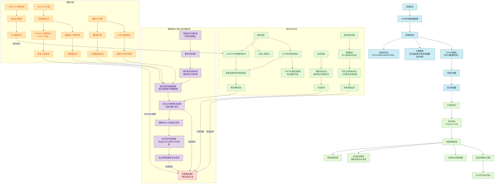
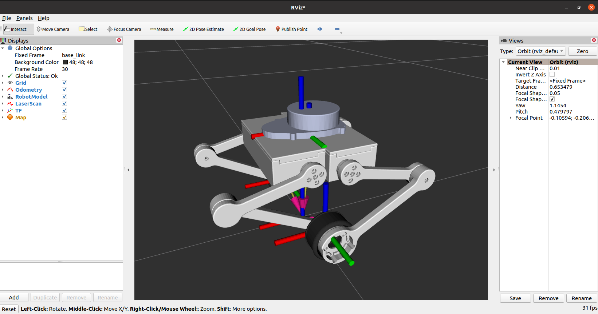
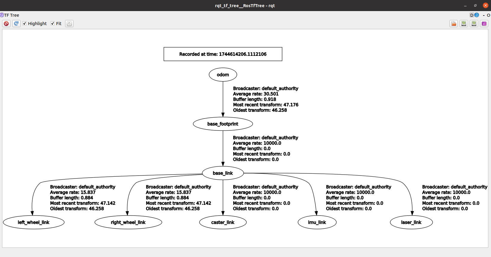
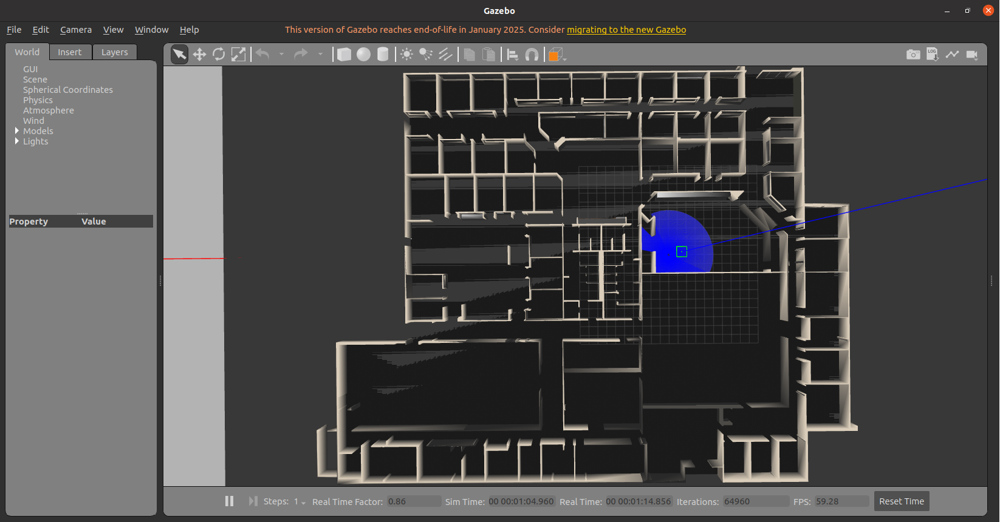
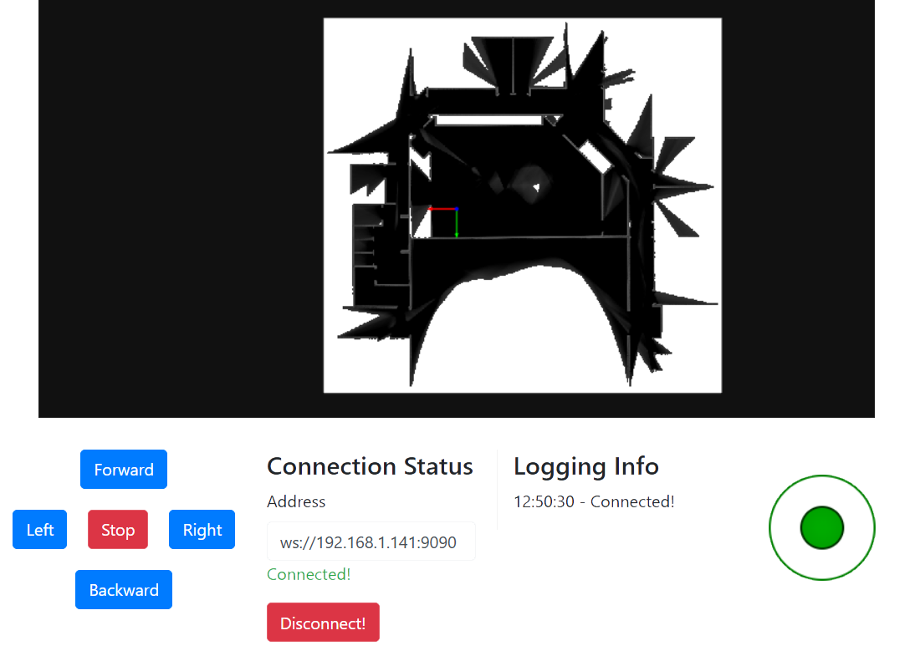

**English | [简体中文](README_cn.md)**
<div id="top"></div>

[![Contributors][contributors-shield]][contributors-url]
[![Forks][forks-shield]][forks-url]
[![Stargazers][stars-shield]][stars-url]
[![Issues][issues-shield]][issues-url]
[![License][license-shield]][license-url]


<!-- PROJECT LOGO -->
<br />
<div align="center">
    <a href="https://github.com/MoonGrt/Wheel_Robot">
    
    </a>
<h3 align="center">Wheel_Robot</h3>
    <p align="center">
    project_description
    <br />
    <a href="https://github.com/MoonGrt/Wheel_Robot"><strong>Explore the docs »</strong></a>
    <br />
    <a href="https://github.com/MoonGrt/Wheel_Robot">View Demo</a>
    ·
    <a href="https://github.com/MoonGrt/Wheel_Robot/issues">Report Bug</a>
    ·
    <a href="https://github.com/MoonGrt/Wheel_Robot/issues">Request Feature</a>
    </p>
</div>


<!-- CONTENTS -->
<details open>
  <summary>Contents</summary>
  <ol>
    <li><a href="#file-tree">File Tree</a></li>
    <li>
      <a href="#about-the-project">About The Project</a>
      <ul>
      </ul>
    </li>
    <li><a href="#contributing">Contributing</a></li>
    <li><a href="#license">License</a></li>
    <li><a href="#contact">Contact</a></li>
    <li><a href="#acknowledgments">Acknowledgments</a></li>
  </ol>
</details>


<!-- FILE TREE -->
## File Tree

```
└─ Project
  ├─ Document
  ├─ Software
  ├─ Tool
  └─ /Hardware/

```


<!-- ABOUT THE PROJECT -->
## About The Project

- [📦 硬件系统设计](#-硬件系统设计)
  - [🔋 电源管理模块](#-电源管理模块)
  - [🧩 FOC驱动器](#-FOC驱动器)
  - [🐞 调试器](#-调试器)
  - [🧲 磁编码器](#-磁编码器)
- [🔧 结构设计与执行单元](#-结构设计与执行单元)
  - [🎯 传感器选型](#-传感器选型)
  - [⚙️ 动力系统](#-动力系统)
  - [🧱 外壳与机构](#-外壳与机构)
- [💻 软件系统设计](#-软件系统设计)
  - [⚡ FOC电机控制子系统](#-FOC电机控制子系统)
  - [🤖 ROS系统集成](#-ROS系统集成)
  - [🌐 Web控制台](#-web控制台)

### 硬件选型
| 模块       | 组件/芯片型号        | 功能描述                             | 器件参数                             |
|------------|----------------------|--------------------------------------|--------------------------------------|
| 主控       | 树莓派               | 搭载ROS，负责SLAM算法                | -                                    |
|            | STM32F405            | 专用于电机控制（FOC、PID）          | 主频180MHz，Cortex-M4内核           |
| 传感器     | AS5147P              | 超高速磁性旋转位置传感器            | 16位分辨率，SSI接口                  |
|            | CMP10A              | IMU传感器                            | 三轴陀螺仪、三轴加速度计，三轴磁力计和气压计 |
|            | YDLIDAR X3           | 激光雷达                             | 360°扫描，测距范围0.12-8m            |
| 电源管理   | 锂电池               | -                                    | 24V，3000mAh，XT60插口               |
|            | TPS54160 + RT9193/LP5907 | 24V→12V/5V→3.3V两级降压稳压         | TPS54160-Buck, RT9193-VCC, LP5907-AVCC |
|            | FSMD012              | 自恢复保险丝-过流保护               | 50A峰值电流                          |
|            | NCP18XH103F0         | 实时监测电路温度，防止过热损害      | 10kΩ B值-25℃/100℃-3455K             |
|            | LM5109B + RTP50W     | 高速半桥驱动器控制耗散电阻          | 5V-18V驱动器 + 50W功率电阻，2ohm      |
|            | SS34                 | 肖特基二极管                        | 3A，40V，低压降                      |
|            | SMAJ26CA             | TVS二极管，浪涌抑制保护             | 30V，双向，400W                      |
|            | 1812电容×10         | 去耦滤波                             | 50V，47µF，陶瓷电容                  |
| 电机驱动   | DRV8301              | 无刷直流BLDC电机驱动芯片            | 4.5V-60V，峰值电流4A                 |
|            | KNY3406C             | 场效应管（MOSFET）                  | Vds=40V，Id=60A，Rds(on)=6mΩ        |
|            | SG995                | 舵机，位置控制                      | 180°转角，扭矩`13kg.cm @ 6V`          |
|            | PM3510               | 平台无刷电机                        | 1250rpm 0.11N.m                      |

### 📦 硬件系统设计

<p align="center" style="margin-top:0px; margin-bottom:0px; margin-left:0px; margin-right:0px; -qt-block-indent:0; text-indent:0px;"></p>

#### 🔋 电源管理模块

电源管理模块将电池能量，经过降压稳压滤波，分配给Raspberry Pi、电机驱动器、传感器（IMU、Lidar、编码器）、动力系统（BLDC电机、舵机）等模块，确保各模块的电源稳定运行。

- **电池管理系统（BMS）**
  - 使用 **24V 3000mAh 锂电池组**（XT60 接口）作为主电源。
    - 29.4V 2A 充电器
    - 内置智能保护板，输出稳定，寿命更长：
      - 过流保护：防止电池放电电流过大
      - 短路保护：产品在发生短路时自动保护
      - 过压保护：防止电池充放电电压过高
      - 过充保护：防止电池过度充电
      - 过放保护：防止电池过度放电
      - 防反保护：反插时自动停止工作
  - 10A 钮子开关（总开关：用于控制电池充电/放电；紧急断开电池） + 16AWG 导线
  - 焊接部分用绝缘绿油覆盖 + 导线连接部分用热缩管/绝缘胶带

- **电压转换**
  - **两级降压架构**：
    - 电源24V：通过功率MOS直接供电BLDC电机、BUCK降压电路、电源电压采集电路等模块。
    - 第一级：TPS54160（24V→12V，供电耗散电阻；24V→5V：供电舵机、Raspberry、LDO）(输出电流1.5A，开关峰值限制电流1.7~2.3A)
      - TPS54160 配置参考 [德州仪器官方设计工具](https://www.ti.com.cn/product/cn/TPS54160#tech-docs)
    - 第二级：RT9193（5V→3.3V，LDO线性稳压，VCC，供电MCU、编码器芯片、电机驱动芯片）、LP5907（3.3V→5V，稳压器，AVCC，供电模拟端温度采样）
  - **去耦滤波网络**：10×1812陶瓷电容（50V/47µF）+ 1812陶瓷电容（63V/47µF）
    - 将与TVS二极管最近的电容改为63V/47µF，防止上电时的浪涌现象导致电容击穿。
  - **隔离地**：模拟地/功率地与数字地隔离，避免信号干扰。

- **电路保护设计**
  - **过流保护**：FSMD012自恢复保险丝（48V/40A）
  - **温度监测**：10kohm NCP18XH103F0热敏电阻（B值-25℃/100℃-3455K）
  - **反接保护**：SS34肖特基二极管（40V/3A）
  - **软启动保护**：TPS54160 软启动设置引脚外接 6.8n电容（电容值越大，启动越缓慢）
  - **瞬态抑制**：SMAJ26CA（反向截止电压(Vrwm)：26V；钳位电压：42.1V；峰值脉冲电流(Ipp)：9.5A）、旁路电阻（10Ω）
    - 之前使用的SMAJ30CA，钳位电压约为 48.4V，浪涌电流非常大，在TVS反应前，电压瞬间升高至电容击穿电压以上，导致与TVS最近的电容击穿。（电池输出电压为24V~29V）
    - 之前使用3.3Ω的电阻，对浪涌抑制能力有限
  - **LM5109B** 高速半桥驱动器 + **RTP50W** 2Ω/50W 耗散电阻，提升电机系统稳定性。
    - 如果没有功率耗散电阻，则会在减速期间将多余的功率回充到供电电源，以达到所需的减速扭矩。如果供电电源不能够吸收掉这些能量（一般使用电池供电才可以吸收这些能量），母线电压将不可避免地升高。这有可能造成开关电源被损坏。本设计中虽然使用电池供电，但仍然使用 RTP50W 耗散电阻，以提升电机系统稳定性。
    - 功率电阻的功率选择取决于您对电机的配置和电机减速时产生的峰值功率或者平均减速功率。为了安全起见，需要考虑电机的转速和电机所能承受的电流。当以最大速度和最大电机电流制动时，功率耗散电阻中消耗的功率可以计算为： P_brake = V_emf * I_motor 其中 V_emf = motor_rpm / motor_kv。在本次设计中，使用 1250rpm 45rmp/v 0.93A 的 PM3510 电机，则 P_brake = 1250 / 45 * 0.53 = 25.83W。

#### 🧩 FOC驱动器

基于STM32F4系列微控制器的双电机FOC驱动方案，支持无刷电机矢量控制，集成编码器接口、HALL传感器、CAN通信和多种外设接口。它结合了强大的微控制器与专用驱动芯片，实现了精准、高响应的闭环控制。

<p align="center" style="margin-top:0px; margin-bottom:0px; margin-left:0px; margin-right:0px; -qt-block-indent:0; text-indent:0px;"></p>

- **主要功能模块**
  - **主控单元**
    - **核心芯片**：STM32F405VGT6（ARM Cortex-M4内核，主频168MHz，1MB Flash，128KB SRAM）
    - **时钟系统**：8MHz晶体振荡器
    - **调试接口**：SWD（SWCLK/SWDIO）
    - **存储器**：W25Q32JV SPI Flash
  - **层级结构**：SIG-PWR-GND-SIG
    - 顶层：信号层+铺铜GND
    - 内1层：走少量信号+铺铜VCC
    - 内2层：电源层铺铜GND
    - 底层：信号层+铺铜GND
  - **电机驱动模块**
    - **驱动芯片**：DRV8301DCAR×2，支持双电机控制
    - **功率级**：
      - 预驱电路：KNY3406C MOSFET ×12
      - 电流采样：0.5mΩ低侧电阻
      - 提供死区控制、可编程门极驱动能力
    - **保护设计**：
      - SMAJ30CA TVS二极管
      - 2.2Ω门极驱动电阻
  - **传感器与反馈**
    - **位置检测**：
      - 编码器接口：ENC_A/B/Z信号
      - HALL传感器接口：GH/GL/SH/SL信号
    - **温度监测**：M0_TEMP/M1_TEMP/AUX_TEMP热敏电阻接口
    - **电压监测**：
  - **通信接口**
    - **CAN总线**：SN65HVD232DR收发器
    - **USB**：CH340K USB转串口
    - **扩展接口**：
      - SPI：MOSI/MISO/SCK/CS
      - I2C：SCL/SDA
      - UART：TX1/RX2
  - **电源管理**
    - **输入电源**：
      - 电池输入：24V DCBUS BUCK降压电路
      - USB供电：Type-C接口
    - **稳压电路**：
      - 3.3V LDO：LP5907MFX-3.3
      - 5V LDO：RT9193-33GB
    - **滤波设计**：
      - 多级LC滤波
      - 陶瓷电容阵列

- **关键设计特性**
  - **双电机架构**：两个独立DRV8301驱动芯片实现双路FOC控制
  - **精密采样**：
    - 40nF差分电容用于电流采样滤波
    - 18kΩ/133kΩ精密电阻网络
  - **安全保护**：
    - NFAULT故障检测电路
    - 死区时间控制（DTC=150kΩ）

- **物理接口**

<div style="width: auto; display: table; margin: auto;">

| 接口类型       | 功能描述                    |
|----------------|----------------------------|
| FPC-6 P        | 下载、调试接口              |
| 2*20排母       | 树莓派接口                  |
| Type-C         | USB通信                    |

</div>

- **PCB设计特点**
  - 分层地平面：PGND（功率地）/AGND（模拟地）/GND（数字地）分离
  - 大电流路径：1oz铜厚 20~50mil宽，覆铜加强散热
  - 测试点：TP1-TP6方便关键信号测量

- **版本**

<p align="center" style="margin-top:0px; margin-bottom:0px; margin-left:0px; margin-right:0px; -qt-block-indent:0; text-indent:0px;"></p>


#### 🐞 调试器
本电路基于STM32F103CBT6微控制器实现调试器功能，兼容STLink V2和DAPLink固件，支持Type-C USB接口和SWD/JTAG调试。主要目的：迷你化（11mm x 26mm）、便携化（将SWD和UART结合用FPC-6接口，方便调试器与主控连接，而不是用杜邦线一根一根连接）。

<p align="center" style="margin-top:0px; margin-bottom:0px; margin-left:0px; margin-right:0px; -qt-block-indent:0; text-indent:0px;"></p>

- **主要模块**
  - **电源模块**
    - **LDO电路**：5V转3.3V（型号662K）
    - **滤波电容**：输入：1µF；输出：100nF
    - **电源指示灯**
    - **电源保护**：BSMD0805-100-6V，PPTC自恢复保险丝，用于防止过流。
  - **主控芯片**
    - **型号**：STM32F103CBT6（72MHz，128KB Flash，64KB SRAM）
    - **时钟源**：8MHz晶振配22pF负载电容
  - **外围电路**
    - **复位电路**：10kΩ上拉电阻 + 100nF滤波电容
    - **LED指示灯**：电源指示、调试状态指示、串口通信指示
    - **电源采集**：将电源的一半电压值采集到ADC输入MCU
  - **连接器**
    - **USB接口**：Type-C USB接口
    - **FPC接口**：6Pin，UART+SWD接口，
    - **调试接口**：4Pin SWD标准接口，用于调试器的固件烧录
- **特殊设计**
  - **DTC143ZCA**：数字晶体管：用于检测 VBUS 是否有效，从而控制 USB_RENU 信号
    - R10、R15、R13 等电阻与 Q1 配合，形成一个简单的电压检测与拉低控制。当 VBUS 检测到 5V，Q1 导通，USB_RENU 被拉高（或拉低），提示MCU "USB插入检测"。

#### 🧲 磁编码器
高精度磁性旋转位置传感器设计的非接触式编码器，兼容AS5147P、AS5047P，适用于电机位置检测，支持多种输出模式，具备抗干扰和高温工作特性。AS5147P自带一个LDO，因此不需要额外的LDO。（主要作用：连接/焊接编码器芯片，给编码器芯片供电-电源保护，给主控提供编码器接口用于连接）

<p align="center" style="margin-top:0px; margin-bottom:0px; margin-left:0px; margin-right:0px; -qt-block-indent:0; text-indent:0px;"></p>

- **核心特性**
  - **分辨率**：14位绝对位置输出（0.022°精度）
  - **接口支持**：
    - SPI（SCK/SDI/SDO/CS）
    - ABZ
    - UVW
    - PWM脉冲宽度调制
  - **工作电压**：3.3V/5V宽压兼容
    - 提供拨码开关供用户选择输入电压模式
  - **机械特性**：360°无接触旋转检测
- **硬件设计要点**
  - **抗干扰设计**
    - 电源滤波：100nF陶瓷电容并联
    - 信号隔离：磁栅与PCB走线正交布局
  - **防护设计**
    - SMFJ5.0A：静电和浪涌保护(TVS/ESD)
    - LED：指示电源状态
  - **尺寸设计**：结合机械设计，要嵌入外壳，尺寸为26mm

---

### 🔧 结构设计与硬件选型

<p align="center" style="margin-top:0px; margin-bottom:0px; margin-left:0px; margin-right:0px; -qt-block-indent:0; text-indent:0px;"></p>

#### 🧱 外壳与结构
- **3D 打印外壳**
  - 结构：模块化拼装，带快拆接口，便于维护和功能拓展。
  - 内部预留电池仓、电路板固定孔位、散热设计。
  - 结构件间预留0.2mm的公差
  - Base：
    - 材质：X树脂（大件，节约成本）
    - 厚度：3mm
    - 结构：
      - 中间装配凸台固定主控板和驱动板
      - 两侧固定舵机
      - 前后开口暴露主控板、驱动板接口以及钮子开关固定孔位。
      - 底部：中间下沉固定IMU模块；两侧预留Battery Case的滑槽卡扣孔位。
      - 预留连接的螺纹孔、螺栓沉头孔
  - Cover：
    - 材质：X树脂（大件，节约成本）
    - 厚度：3mm
    - 结构：
      - Base 固定孔位
      - 装配凸台固定ydlidar，中间下沉固定ydlidar驱动板
      - 预留连接的螺纹孔、螺栓沉头孔
  - Battery Case：
    - 材质：X树脂（大件，节约成本）
    - 厚度：3mm
    - 结构：
      - 中间下陷固定电池
      - 两侧部分上凸形成与Base的卡扣
      - 前后面右上角开孔，预留电池线孔位
      - 预留连接的螺纹孔、螺栓沉头孔
  - Arm：
    - 材质：PLA
    - 厚度：8mm
    - 结构：
      - 固定舵机和Motor Case
      - Arm间轴承连接
      - 预留电机线、编码器线空间
      - 控制电机径向磁铁同编码器的距离（<1mm）
      - 预留连接的螺纹孔、螺栓沉头孔
  - Motor Case：
    - 材质：PLA
    - 厚度：3mm
    - 结构：
      - 固定电机、磁编码器
      - 预留轴承空间
      - 外部内陷，预留橡胶圈空间
      - 预留连接的螺纹孔、螺栓沉头孔

#### ⚙️ 动力系统
- **无刷直流电机**
  - 型号：**PM3510**
  - 参数：1250rpm，0.11N·m，45 rmp/v，驱动芯片为 DRV8301。
  - Note：
    - 需更换电机径向磁铁（原有电机径向磁铁磁性较差，导致编码器噪声大）。
    - 安装更强力编码器磁铁时，需考虑机械设计中磁铁与编码器距离。
- **舵机**
  - 型号：**SG995**
  - 参数：20ms，180°旋转角（500-2500），13kg·cm 扭矩（@6V），100mA。
  - Note：
    - 注意安装时的初始角度，避免旋转方向错误。

#### 🎯 传感器选型

##### **AS5147P 高速旋转位置传感器**

- **产品概述**
  - **AS5147P** 是一款基于 CMOS 技术的 14 位高分辨率轴向磁旋转位置传感器，专为高达 **28,000 RPM** 的高速应用设计，提供完整的 **360° 绝对角度测量**。它集成了先进的 **动态角度误差补偿（DAEC™）** 技术，能够有效抑制由系统延迟引起的角度误差，实现几乎**零延迟输出**。
  AS5147P 同时具备 **12 位二进制增量输出接口（ABI）**，分辨率高达每转 **4096 步/1024 脉冲**，适配编码器系统。通过标准 **4 线 SPI 接口**，主控设备可读取传感器输出的高精度角度信息，同时支持编程非易失性配置，无需外接编程器。

- **主要特性**

  <div style="width: auto; display: table; margin: auto;">

  | 特性类别           | 描述                                                         |
  |--------------------|-------------------------------------------------------------|
  | **分辨率**          | 14 位绝对角度-SPI<br>12 位增量编码（ABI：1024/2048/4096）    |
  | **速度支持**        | 高达 **28,000 RPM**，适用于高速旋转检测                      |
  | **输出接口**        | SPI、ABI、UVW 换向信号、PWM 占空比编码输出           |
  | **动态角度补偿**    | DAEC™ 动态角度误差补偿（针对 SPI、ABI、UVW 输出，提升实时性）  |
  | **抗干扰能力**      | 抑制均匀杂散磁场干扰，提升系统稳定性                          |
  | **非易失性配置**    | SPI 接口可编程，无需专用编程器                                |
  | **自诊断功能**      | 检测磁场强度异常（过强/过弱/缺失）、设备状态异常等             |
  | **插值与信号完整性**| 在高速下插补缺失 ABI 脉冲，确保分辨率和信号连续性              |

  </div>

- **技术原理与结构**
  - AS5147P 采用 **霍尔效应传感器阵列**，通过感应垂直于芯片表面的磁通密度，将磁场分量转换为电压信号。经过模拟前端（AFE）放大和滤波后，这些信号被送入模数转换器（ADC），再经由 CORDIC 算法处理，精确计算出磁矢量的角度与幅度。此外，AS5147P
    - **自动增益控制（AGC）** 机制：实时调节前端增益，适应磁场与温度变化
    - **CORDIC 算法模块**：计算旋转角度与磁场幅值
    - **插值机制**：在高转速下补全 ABI 缺失脉冲，保障输出信号连续性
  - AS5147P 具有 **动态角度误差补偿（DAEC™）** 功能，通过对角度测量过程中的时间延迟进行估计，并据此预测并补偿角度输出误差，从而提升 SPI、ABI 和 UVW 输出的实时性。在恒定速度条件下，该补偿效果尤为显著。


##### **YDLIDAR X3 激光雷达**

YDLIDAR X3 是一款高性能、紧凑型的二维激光雷达（LiDAR）产品，采用三角测距原理，并结合先进的光学、电学与算法设计，能够实现**360 度全方位的环境扫描与高精度距离测量**。

- 🌐 核心功能概述
  - 🔄 **360° 全方位扫描测距**
  YDLIDAR X3 搭载旋转电机，能实现**完整的水平面360度旋转**，在每一圈旋转中实时输出对应角度的测距数据，形成高密度的二维点云图。这意味着它能够**全景感知周围环境**，无需移动平台本身即可获取完整的空间信息。
  - 🎯 **高精度与高频率的测距性能**
  该雷达通过高频率激光脉冲发射与回波接收机制，达到了每秒高达 **4000次的测距能力**（典型值），确保即使在快速移动的环境中也能获得流畅、细腻的感知效果。
    - **典型测距精度：±2cm（≤1m）**
    - **相对误差：最小1%，在远距离下也能控制在3.5%~5%以内**
  - ☀️ **抗环境光干扰能力强**
  YDLIDAR X3 拥有良好的抗干扰能力，可在自然光或人工灯光下稳定工作。无论是明亮的日光照射还是室内灯光频闪，它都能维持稳定输出，保证测距数据的可靠性。
  - 🔋 **低功耗、小体积、长寿命**
  产品设计注重节能与便携，具备低能耗运行特性，并采用长寿命旋转结构与光电元件，适合长期部署在各种智能设备中。
  - ⚙️ **电机转速可调，适应不同需求**
  用户可根据应用需要调整扫描频率，从 **5Hz 到 10Hz** 可选，平衡测量精度与实时性能。例如：
    - **5Hz 时：角度分辨率可达 0.6°**，适合对精度要求高的场景（如建图）
    - **10Hz 时：角度分辨率为 1.2°**，更适合对实时性要求更高的任务（如避障）

- ⚙️ 性能参数

  <div style="width: auto; display: table; margin: auto;">

  | 项目             | 最小值 | 典型值 | 最大值 | 单位 | 备注                         |
  |------------------|--------|--------|--------|------|----------------------------|
  | 测距频率         | /      | 4000   | /      | Hz   | 每秒最多测距 4000 次         |
  | 扫描频率         | 5      | 8      | 10     | Hz   | 电机可调                     |
  | 测距范围         | /      | 0.12/8 | /      | m    | 10%/80%反射                  |
  | 扫描角度         | /      | 0-360  | /      | °    | 旋转360度                    |
  | 测距绝对误差     | /      | 2      | /      | cm   | ≤1m 范围内                   |
  | 相对误差         | /      | 1%     | 5%     | /    | 最大相对误差在8m距离时        |
  | 角度分辨率       | 0.6    | 0.96   | 1.2    | °    | 分别对应5Hz/8Hz/10Hz         |
  | 俯仰角           | 0.25   | 1      | 1.75   | °    | 束角控制范围                 |

  </div>


##### **CMP10A-IMU 惯性测量单元**

CMP10A是基于MEMS技术的高性能三维运动姿态测量系统。它包含三轴陀螺仪、三轴加速度计，三轴电子罗盘运动传感器和气压计。通过集成各种高性能传感器和运用自主研发的姿态动力学核心算法引擎，结合高动态卡尔曼滤波融合算法，为客户提供高精度、高动态、实时补偿的三轴姿态角度，通过对各类数据的灵活选择配置，满足不同的应用场景。

- **产品特性**
  - 模块集成高精度的陀螺仪、加速度计、地磁场传感器和气压计，采用高性能的微处理器和先进的动力学解算与卡尔曼动态滤波算法，能够快速求解出模块当前的实时运动姿态。
  - 采用先进的数字滤波技术，能有效降低测量噪声，提高测量精度。
  - 模块内部集成了姿态解算器，配合动态卡尔曼滤波算法，能够在动态环境下准确输出模块的当前姿态， 姿态测量精度静态 0.05 度，动态 0.1 度，稳定性极高，性能甚至优于某些专业的倾角仪。
  - Z轴航向角加入地磁传感器滤波融合，解决了6轴算法中，由于陀螺仪积分的漂移引起的累计误差，可长期稳定输出航向角数据。注意：要由于有磁场检测，使用前需要校准，而且使用时需要远离磁干扰区域、电子设备、磁铁、扬声器等硬磁性物体至少20cm的距离。
  - 模块内部自带电压稳定电路，工作电压3.3~5V，引脚电平兼容3.3V/5V的嵌入式系统，连接方便。
  - 支持串口和IIC两种数字接口。方便用户选择最佳的连接方式。串口速率4800bps~921600bps可调，IIC接口支持全速400K速率。
  - 最高200Hz数据输出速率。输出内容可以自由选择，输出速率0.2～200Hz可调节。

- **传感器参数指标**

  <div style="width: auto; display: table; margin: auto;">

  | 传感器类型 | 参数       | 条件               | 典型值                   |
  |------------|------------|--------------------|--------------------------|
  | 加速度计   | 量程       |                    | ±16g                     |
  |           | 分辨率     | ±16g               | 0.0005 (g/LSB)           |
  |           | RMS噪声    | 带宽=100Hz         | 0.75~1 mg-rms            |
  |           | 静止零漂   | 水平放置           | ±20~40 mg                |
  |           | 温漂       | -40°C ~ +85°C      | ±0.15 mg/℃              |
  |           | 带宽       |                    | 5~256 Hz                 |
  | 陀螺仪     | 量程       |                    | ±2000 °/s                |
  |           | 分辨率     | ±2000°/s           | 0.061 (°/s)/LSB          |
  |           | RMS噪声    | 带宽=100Hz         | 0.028~0.07 (°/s)-rms     |
  |           | 静止零漂   | 水平放置           | ±0.5~1 °/s               |
  |           | 温漂       | -40°C ~ +85°C      | ±0.005~0.015 (°/s)/℃    |
  |           | 带宽       |                    | 5~256 Hz                 |
  | 磁力计     | 量程       |                    | ±2 Gauss                 |
  |           | 分辨率     | ±2Gauss            | 0.0667 mGauss/LSB        |
  | 气压计     | 量程       |                    | 300~1100 hPa             |
  |           | RMS噪声    | 标准模式           | 0.5 Pa-RMS               |
  |           | 相对精度   |                    | ±0.06 hPa                |

  </div>


#### **结构连接**
轴承 轧带 绝缘胶布 电线 导线 螺栓 螺母 橡胶圈（轮胎） 502胶水

---

### 💻 软件系统设计

<p align="center" style="margin-top:0px; margin-bottom:0px; margin-left:0px; margin-right:0px; -qt-block-indent:0; text-indent:0px;"></p>

#### ⚡ FOC电机控制子系统

##### RT-Thread 实时操作系统
实现任务隔离：控制线程、电流采样线程、通信线程独立运行；



- 🟦 **初始化阶段**
  - 从 `系统启动` 开始：
  - **从NVM加载配置参数**：用于加载之前保存的系统参数，比如电机配置、校准数据等。
  - **系统初始化**：分为三个关键部分：
    - `GPIO/PWM/USB/SPI/DMA` 等外设初始化。
    - 中断配置，包括中断优先级设置、注册ISR。
    - RTOS（实时操作系统）初始化，启动调度器、内存堆栈等。
  - 最后，创建主线程并启动调度器。
- 🟩 **主线程运行逻辑**
  - **启动外设**：如 PWM 输出、电流采样ADC、定时器等。
  - **创建三个辅助线程**：
    - **通信处理线程**：USB/CAN/UART 接收、状态上传。
    - **系统监控线程**：如温度、电压监控和故障检测。
    - **电机状态管理线程**：周期更新各个轴的工作状态。
  - 主线程任务完成后退出，系统进入实时运行状态。
- 🟨 **实时运行阶段**
  - **通信线程（H1）**
    - 处理 USB/CAN/UART 指令。
    - 上报状态数据。
    - 解析控制指令，更新控制目标，进入控制链（与控制核心关联）。
  - **系统监控线程（H2）**
    - 定期采集温度、电压、错误标志等。
    - 进行异常检测，发现问题后向 `错误处理D1` 汇报。
  - **电机状态管理线程（H3）**
    - 周期刷新电机状态，反馈给控制系统。
    - 传递工作模式变化、错误信息等。
- 🟪 **核心控制链**：这是控制系统的“心脏”部分,由定时器中断驱动：
  - 高精度定时器中断触发 → 控制周期开始。
  - 启动软中断执行控制逻辑：
    1. **采样数据**：读取编码器、电流传感器等。
    2. **执行控制算法**：包括位置、速度、电流的闭环控制。
    3. **更新PWM**：输出到电机驱动。
    4. **周期安全检查与状态复位**。
  - 若检测到异常，会立刻进入 `错误中断处理`，停机/保护。
- 🟧 **辅助中断模块**：补充控制逻辑的中断事件：
  - **通信中断**
    - 接收USB/CAN外部控制数据，将其写入指令队列，后由通信线程解析执行。
    - UART DMA 中断
  - **GPIO 中断**
    - 检测如 `DRV8301 nFAULT` 故障信号。
    - 编码器的 Z 相中断，用于一次性校准（如原点对齐）。
  - **定时器中断**
    - 编码器边沿捕捉、PWM宽度捕捉，用于转速和位置测量。

- Note:
  - 注意为什么线程执行控制，而使用定时器中断？


##### PID调节流程-FOC算法

控制算法采用三级闭环架构，由上至下依次是位置控制、速度控制及电流控制。控制线程在每个控制周期内依次接收新的输入指令、读取编码器与电流传感器反馈、执行各级 PID 算法并更新控制输出。整个处理过程同时嵌入了防积分饱和、限幅、增益调度以及抗齿槽校准等措施，以保证高精度与鲁棒性。

- **控制链整体流程**
  ```mermaid
  graph LR
      A[上位机传入目标指令<br>位置/速度/电流] --> B[输入处理 & 轨迹规划<br>多模式滤波/Trap Traj / Mirror等]
      B --> C[位置环：比较目标位置与当前编码器或估算值，计算位置误差]
      C --> D[基于 P 控制（及抗齿槽补偿等）生成额外的速度期望]
      D --> E[速度环：将位置环输出的期望速度与实际速度比较<br>以 PI 结构计算扭矩或电流期望]
      E --> F[转换：扭矩期望经电机参数与扭矩常数转换为电流期望<br>ACIM 型电机需要按磁通进行缩放]
      F --> G[电流环（FOC）：进入 d-q 坐标系，使用 PI 算法控制电流误差]
      G --> H[计算出电压命令，经 SVPWM 模块变换生成 PWM 波形]
  ```

  其中：
  - **输入处理** 根据不同的输入模式（Passthrough、速度/扭矩斜坡、轨迹规划等）更新内部 setpoint，并对环路带宽、限幅等进行滤波。
  - **位置环** 在位置控制模式下，仅采用比例反馈（pos_gain），并配合环路漂移校正、齿槽补偿等措施。
  - **速度环** 除了乘以速度增益（vel_gain）得到一个初步扭矩命令外，还引入积分项（vel_integrator_torque_）进行误差累积，并采用防风控制（增益调度及抗饱和措施）。
  - **电流环** 则在 Field Oriented Control 模块内对 d-q 电流误差进行 PI 调控，积分状态受限于调制矢量饱和条件，并结合前馈项（如反电动势、R/L 前馈）保证系统响应。

- **控制链运行示意**
  控制线程与外设、ADC/FOC 中断之间的交互可以概述为：

  ```mermaid
  graph TD
      %% Node definitions
      subgraph S1[🟦 Underlying Data]
          Sensors[Sensor Node<br/>IMU, Laser, Odometry]:::sensor
          WheelRobot[Wheel Robot Node<br/>Publishes robot description and tf]:::sensor
      end

      subgraph S2[🟩 Functional Modules]
          MotionCtrl[Motion Control Node<br/>Subscribes to IMU / Listens to cmd_vel]:::module
          Cartographer[Cartographer Node<br/>Map building and map publishing]:::module
      end

      subgraph S3[🟨 External Interfaces]
          WebService[Web Service<br/>Sends cmd_vel / Subscribes to map]:::external
      end

      %% Data flow connections
      Sensors -- IMU/Laser/Odom Data --> Cartographer
      Sensors -- IMU Data --> MotionCtrl
      WheelRobot -- Robot Description/TF --> Cartographer

      WebService -- cmd_vel Control Command --> MotionCtrl
      MotionCtrl -- Motion Control Feedback --> Cartographer
      Cartographer -- map Data --> WebService

      %% Style settings
      classDef sensor fill:#cce5ff,stroke:#3399ff,stroke-width:2px;
      classDef module fill:#d4edda,stroke:#28a745,stroke-width:2px;
      classDef external fill:#fff3cd,stroke:#ffc107,stroke-width:2px;
  ```

  在此过程中：
  - **输入处理**：不仅包括直接的 setpoint 传递，还包含滤波、斜坡更新、Trap Traj 插值、镜像模式等多种逻辑。
  - **各环节反馈**：位置与速度误差分别影响低频与中频控制，而电流环运行在较高频率下，确保整个闭环响应及时。
  - **错误保护与监控**：在控制线程内部不断检测传感器有效性、限幅状态及功率不匹配情况，一旦异常会触发保护（如停机或错误上报）。

- **位置环** PID（慢速闭环）
  - **输入**：目标位置（pos_setpoint）与实际位置（编码器 / PLL 或 sensorless 估算）。
  - **输出**：生成目标速度（vel_setpoint）的修正值。
  位置环常采用纯比例控制（P 控制），同时应对循环型 setpoints 做周期处理。部分模式下，还会将抗齿槽校准数据叠加到误差修正中。

  ```cpp
  // 注意：实际代码中会区分线性与循环型 setpoints，
  // 同时引入防止漂移和增益调度（在误差较小时降低反馈增益）。
  float pos_error = pos_setpoint - pos_estimate;
  if(config_.circular_setpoints) {
      pos_error = wrap_pm(pos_error, pos_wrap_value);
  }
  vel_setpoint = vel_setpoint_base + config_.pos_gain * pos_error;
  ```

- **速度环** PID（中速闭环）
  - **输入**：位置环生成的期望速度（含位置 P 补偿）、实际速度（来自编码器 / PLL 输出）。
  - **输出**：计算得到一个扭矩期望，该值经转换后代表电流（iq_setpoint）。
    实现采用 PI 控制结构，其中积分项经过防饱和（如限幅或衰减）处理。示例代码概念如下：

  ```cpp
  float vel_error = vel_desired - vel_estimate;
  vel_integrator_torque_ += (vel_integrator_gain * vel_error * dt);
  vel_integrator_torque_ = std::clamp(vel_integrator_torque_, -config_.  vel_integrator_limit, config_.vel_integrator_limit);
  // 这里还可能结合增益调度：在小误差时降低 P 作用    （gain_scheduling_multiplier）
  float torque = torque_setpoint + (vel_gain * gain_scheduling_multiplier * vel_error) + vel_integrator_torque_;
  ```

  其中：
  - **输入模式**：不同模式（如 VEL_RAMP、TRAP_TRAJ、MIRROR、TUNING 等）决定了如何更新 pos_setpoint/vel_setpoint/torque_setpoint；
  - **限幅机制**：通过限制 torque 和 vel_setpoint 保证系统输出不超出安全范围；
  - **错误检测**：例如当检测到超速（overspeed error）或 spinout（机电功率不匹配）时，立即触发错误状态。

- **电流环** PID（FOC 控制，高速闭环）
  - **输入**：目标电流（iq_setpoint 与（可选）id_setpoint）与测量电流（ADC 采样并经过 Clarke / Park 变换得到的 Iq、Id）。
  - **输出**：经过 PI 控制（包括前馈项）计算出 d-q 坐标系下的电压命令，再经逆 Park 变换和 SVPWM 算法转换为 PWM 波形。示例代码概念如下：

  ```cpp
  // 以 Iq 分量为例（Id 一般保持或跟踪一个预定的值，取决于算法与电机类型）
  float Ierr_q = iq_setpoint - iq_measured;
  v_current_control_integral_q_ += Ierr_q * (i_gain * dt);

  // 如果检测到过调制（输出矢量幅值超出限制），则对积分项做衰减处理（防积分风暴）
  float mod_scalefactor = /* 根据当前输出模量计算的缩放因子 */;
  if (mod_scalefactor < 1.0f) {
      // 锁死或衰减积分
      v_current_control_integral_q_ *= 0.99f;
  }
  vq = Vq_feedforward + (p_gain * Ierr_q + v_current_control_integral_q_);
  ```

  再经过类似下面的逆 Park 变换和 SVPWM 算法：

  ```cpp
  // 将 d-q 坐标的 mod_d, mod_q 转换至 α-β 坐标
  float c_p = cos(pwm_phase);
  float s_p = sin(pwm_phase);
  float mod_alpha = c_p * mod_d - s_p * mod_q;
  float mod_beta = c_p * mod_q + s_p * mod_d;

  // SVM 模块将 (mod_alpha, mod_beta) 映射为 PWM 定时（tA, tB, tC）
  auto [tA, tB, tC, success] = SVM(mod_alpha, mod_beta);
  ```

  - 注意：实际控制中当前控制状态会用于前馈和负载预测，同时考虑 R/L 及反电动势的前馈补偿，这部分代码在 Motor::update() 和 FieldOrientedController::get_alpha_beta_output() 中均有所体现。

  > **补充说明**：
  > - 所有各环节的 PID 参数（例如 pos_gain、vel_gain、vel_integrator_gain、当前环 p_gain、i_gain 等）均在系统初始化时从 NVM 加载，参数的调节直接影响闭环动态与稳定性。
  > - 另外，各输入模式（例如轨迹规划模式 TRAP_TRAJ）和抗齿槽校准（anticogging）措施，也会在 PID 控制链之前完成 setpoint 的预处理，从而保证控制指令平滑、鲁棒。


##### 驱动程序开发
- **编码器（ASA5147P）**：支持多种类型，包括： SPI, ABI, UVW, PWM；该电机驱动器支持两种模式：
  - ABZ模式：使用stm32F4定时器外设的encoder模式，读取电机编码器的位置和速度反馈
  - SPI模式：直接读取ASA5147P的寄存器，精度较高14位
- **FLASH（W25Q32JVSSIQ）**：用于存储参数、配置等；
- **电机驱动（DRV8301）**
  - SPI初始化、配置芯片
  - 使用stm32F4高级定时器TIM1 TIM8：用于三相电机驱动，减少电磁干扰；互补PWM输出，带死区时间配置（在向下计数时强制PWM为50%），防止上下桥臂直通短路
- **舵机驱动（SG995）**：TIM2的PWM模式，控制舵机的角度。


##### 通信协议
- **USB CDC/HID** **CAN 总线**
  - fibre 协议栈：一套上位机与下位机通信用的应用层协议。根据ymal文件内容生成相应的通信协议栈。
  - 数据类型：数据包的格式 流的格式
- **UART 串口**：与外部传感器或树莓派通信。
  - 串口通信协议：UART 921600 8N1，ASCII格式；以100Hz频率持续发送电机位置和速度信息。

##### 配置工具 UI
- **参数配置工具**
  - 基于QT的可视化界面；
  - 可视化调参：电机极对数、编码器CPR、刹车电阻设置……；
  - 一键校准：测量电机的电气特性（即电机相电阻和相电感），以及编码器偏移校准；
  - 实时监控：电压、电流、温度反馈。
  - **注意**：本项目中使用的是平台无刷电机，
- **PID配置工具**：进一步释放FOC驱动板性能。通过调整PID参数，控制器可以快速响应系统中的干扰或变化（例如施加的外力或设定值的变化）而不会变得不稳定，可确保电机驱动板能够以最有效的方式控制电动机。
  - 基于QT的可视化界面；
  - 实时监控：位置、转速反馈；
  - 滑动条：可视化调节PID参数；
  - **经验**：先把速度环Ki设置为0，把位置环的Kp设置成一个比较小的值。逐渐增大速度环的Kp，每次迭代增加约30％，直到电机出现震动。实际随着Kp的增大，电流声越来越大，最后会高频震动。退回速度环的Kp至振动值的50％，然后设置积分器为0.5 * bandwidth * vel_gain，其中bandwidth是系统的总跟踪带宽。本项目中，bandwidth为10hz。按照公式设置速度环的Ki = 0.5 * 10 * vel_gain。随后，逐步调大位置环Kp，直到看到一些过冲。退缩位置环Kp直到不再有超调为止。调试中可以给一个Kp，再给一个位置目标，看阶跃响应。
  - **注意**：测试发现电流声的大小和位置环的Kp无关，和速度环的Kp有关，把速度环Kp减小，电流声就会小很多。按理说应该位置环的Kp越大越有超调，可实际发现Kp比较小的时候，电机很软，此时反而有超调。感觉是因为此时电机太软了，到了目标位置有点控制不住。

---

#### 🤖 ROS系统集成

##### 🧪 仿真平台构建
先搭建SLAM仿真平台，便于快速进行算法验证、参数调试。实物电池容量有限，且容易损伤影响项目进度。

- **URDF**：机器人模型结构建模；
  - **sw_urdf_exporter工具**：https://github.com/ros-industrial/sw_urdf_exporter
    - 对solidworks建模进行坐标化参数化，使用工具sw_urdf_exporter将结果转换为URDF格式；
    - 难以对轮足机器人进行直接仿真，这里则简单将轮足机器人转化为两轮差速模型进行试验；
    - 工具将自动根据模型材料计算质量和惯性矩，并生成相应的STL文件。
  - **Wheel_Robot**：基础底座（base_link）、激光雷达（laser_link）、IMU（imu_link）、左右驱动轮（left_wheel_link、right_wheel_link）
    - base：固定IMU、激光雷达、8个Arm（简化模型：将arm直接固定在底座上，无法上下移动）
      - 质量：0.459 kg，是机器人的主体部分。
      - 惯性原点：位于 (-0.00238, 0, 0.0969)，可能因设计重心偏移。
      - 几何与碰撞：均使用 base_link.STL 文件定义。
    - laser：
      - 质量：0.0866 kg，轻量化设计。
      - 安装位置：通过 laser_joint 固定在 base_link 的 (-0.0005, 0, 0.1246) 处。
      - 功能：激光雷达传感器，位于机器人顶部。
    - imu：
      - 质量：0.00216 kg，极轻。
      - 安装位置：通过 imu_joint 固定在 base_link 的 (-0.01, 0, 0.0946) 处。
      - 功能：惯性测量单元，靠近底座中心，用于姿态检测。
    - wheel：
      - 质量：约 0.01686 kg，对称设计。
      - 几何与碰撞：均使用 left_wheel_link.STL 和 right_wheel_link.STL。
      - 安装位置：
        - 左轮：(0, 0.0655, 0.02596)，绕 y 轴旋转（axis="0 1 0"）。
        - 右轮：(0, -0.0655, 0.02596)，绕 y 轴负方向旋转（axis="0 -1 0"）。
        - 轮间距：0.174 m（对称分布于 base_link 两侧）。

<p align="center" style="margin-top:0px; margin-bottom:0px; margin-left:35px; margin-right:0px; -qt-block-indent:0; text-indent:0px;"></p>

- **Gazebo**：实现完整仿真环境；
  - **gazebo插件**：在生成的urdf插件中添加插件，才能生成仿真环境允许所需要的传感器数据；
    - **1. 差分驱动插件（`diff_drive`）**：实现差分驱动控制与里程计发布。
      - **轮距（`wheel_separation`）**：`0.174 m`
      - **轮径（`wheel_diameter`）**：`0.026 m`
      - **最大扭矩与加速度**：`20 N·m` 和 `1.0 rad/s²`，适用于小型机器人，但需根据实际电机性能调整。
      - **TF 发布**：`publish_odom_tf` 设为 `true`，确保 `odom` → `base_link` 的坐标变换正常。
    - **2. 关节状态发布插件（`joint_state`）**：发布左右轮关节状态到 `/joint_states`。
      - **更新频率**：`30 Hz`，与差分驱动插件一致，合理。
      - **关节名称**：正确关联 `left_wheel_joint` 和 `right_wheel_joint`，与URDF匹配。
      - **TF 发布**：robot_state_publisher节点运行时发布 `base_link` → `left_wheel_link` 和 `base_link` → `right_wheel_link` 的坐标变换。
    - **3. IMU传感器插件**：配置IMU传感器，并发布IMU数据。
      - **噪声模型**：角速度和线加速度均添加高斯噪声，符合真实IMU特性。
        - **角速度噪声**：标准差 `2e-4 rad/s`，轻微抖动，合理。
        - **线加速度噪声**：标准差 `0.017 m/s²`，偏差均值 `0.1 m/s²`，模拟零偏漂移，符合低成本IMU特性。
      - **更新频率**：`100 Hz`，满足多数SLAM算法需求。
      - **TF 发布**：robot_state_publisher节点运行时发布 `base_link` → `imu_link` 的坐标变换。
    - **4. 激光雷达（LiDAR）插件**：配置激光雷达，并发布激光雷达数据。
      - **扫描参数**：360°扫描，分辨率 `1°`，最大范围 `3.5 m`，最小 `0.12 m`，适用于室内环境。
      - **噪声**：高斯噪声（`stddev=0.01 m`），模拟测量误差，合理。
      - **发布频率**：`5 Hz`，较低，可能影响实时避障，建议提升至 `10-20 Hz`。
      - **安装位置**：`<pose>0 0 0.075 0 0 0</pose>`，相对 `laser_link` 的偏移需与URDF中激光雷达实际高度（`z=0.1246 m`）叠加，确保最终位置正确。
      - **TF 发布**：robot_state_publisher节点运行时发布 `base_link` → `laser_link` 的坐标变换。
  - **仿真场景**：
    - 场景1：[willowgarage](Software\ROS\wheel_robot_sim\src\wheel_robot\worlds\willowgarage.png)
      - Willow Garage 办公环境是一个经典的仿真场景，用于测试机器人导航、SLAM 和人机交互算法。
    - 场景2：[cafe](Software\ROS\wheel_robot_sim\src\wheel_robot\worlds\cafe.png)
      - Cafe World 是一个模拟咖啡馆场景的环境，设计用于测试机器人在动态环境下的导航、SLAM 和人机交互算法。
    - 两者对比
        <div style="width: auto; display: table; margin: auto;">

        | **特性**               | **Willow Garage**            | **Cafe World**               |
        |------------------------|-----------------------------|-----------------------------|
        | **场景类型**           | 办公环境                    | 服务场景（咖啡馆）          |
        | **动态元素**           | 静态障碍物为主              | 动态行人 + 可移动物体       |
        | **测试重点**           | 导航、SLAM                  | 人机交互、避障             |
        | **复杂度**             | 中等（结构化布局）          | 高（动态干扰多）            |

        </div>

<p align="center" style="margin-top:0px; margin-bottom:0px; margin-left:35px; margin-right:0px; -qt-block-indent:0; text-indent:0px;"></p>

<p align="center" style="margin-top:0px; margin-bottom:0px; margin-left:35px; margin-right:0px; -qt-block-indent:0; text-indent:0px;"></p>

- **Cartographer + Navigation2**：实现地图构建与导航路径规划。
  - 地图构建：**Cartographer**；
    - 介绍：Cartographer 是由 Google 开发的开源实时 SLAM（同步定位与地图构建）系统，支持 2D 和 3D 环境的地图构建。它通过融合多传感器数据（如激光雷达、IMU、里程计等），实现高精度且低漂移的实时建图，广泛应用于机器人、自动驾驶等领域。
    - 原理：
      1. **前端扫描匹配**：使用局部子图（Submaps）构建，通过实时激光雷达数据与子图匹配，估计机器人位姿。
      2. **后端优化**：利用闭环检测（Loop Closure）和全局优化（基于图优化的 SLAM 框架）消除累积误差。
      3. **多传感器融合**：结合 IMU、里程计等数据，提升位姿估计的鲁棒性。
    - 优点：
      - **高效实时性**：支持实时建图，适合动态环境应用。
      - **多传感器支持**：灵活融合激光雷达、IMU 等数据，适应复杂场景。
      - **闭环检测强**：显著减少长期运行的累积误差，提升地图全局一致性。
      - **开源可扩展**：代码结构清晰，支持 2D/3D 建图，社区活跃。
    - 缺点：
      - **配置复杂**：参数调节依赖经验，需针对不同传感器和环境优化。
      - **计算资源需求高**：3D 建图或大规模场景下对硬件要求较高。
      - **动态环境处理有限**：主要针对静态环境设计，动态障碍物可能影响建图精度。
    - [配置](Software\ROS\wheel_robot\src\carto\config\carto.lua)：

  - 导航路径规划：**Navigation2**；
    - 介绍：Navigation2 是 ROS 2 中的官方导航框架，用于移动机器人的路径规划与自主导航。支持全局路径规划、局部避障、恢复行为等功能，适用于轮式机器人、服务机器人等场景。
    - 原理：
      1. **全局规划**：基于代价地图（Costmap）和算法（如 A*、Dijkstra）生成全局最优路径。
      2. **局部规划**：结合动态窗口法（DWA）或 Timed Elastic Band（TEB）算法，实时避障并跟踪路径。
      3. **行为树控制**：通过行为树（Behavior Tree）管理导航状态（如重规划、恢复模式）。
    - 优点：
      - **模块化设计**：插件化架构支持自定义算法（如更换规划器或控制器）。
      - **动态环境适应**：实时更新代价地图，有效应对动态障碍物。
      - **跨平台兼容**：基于 ROS 2，支持多种机器人硬件和仿真环境。
      - **行为树管理**：灵活处理复杂导航逻辑（如故障恢复、多目标切换）。
    - 缺点：
      - **实时性局限**：在密集障碍物或复杂地形中，局部规划可能延迟。
      - **依赖传感器质量**：定位（如 AMCL）和避障效果受传感器精度影响大。
      - **配置繁琐**：需针对机器人动力学参数（如速度、加速度）精细调参。
    - [配置](Software\ROS\wheel_robot\src\nav2\param\fishbot_nav2.yaml)：

##### 🚗 实物部署与控制
在完成SLAM仿真实验后，软件上的嵌合已经基本完成，接下来只需要将仿真时使用的gazebo产生的传感器数据更换为实物使用的传感器数据，并进行相应的控制算法调试；再将算法对机器人的控制通过Raspberry Pi与FOC驱动器的通信协议传递到两轮和舵机上。此外，因仿真时使用简单的两轮差速小车模型，实物搭建的轮子机器人需要进行更复杂的控制算法的调试。

- **传感器接入与驱动**
  - **AS5147P**：14位旋转编码器，用于电机位置反馈；
    - Raspbery Pi同电机驱动板的UART通信占用了Rapsberry的串口终端，会导致Raspberry无法进入系统；
      - 禁用 UART0 作为系统控制台，并且禁用蓝牙
      - 取消 Raspberry u-boot 开机等待时间
    - 接收电机驱动板UART通信线程传来的数据，进行解码；
  - **CMP10A IMU**：三轴陀螺仪 + 加速度计 + 磁力计 + 气压计；
    - 通过厂商提供的上位机软件，对IMU模块进行配置校准，并提高采样速率到200Hz；
    - 将IMU模块与Raspberry Pi连接的USB端口绑定，方便后续直接读取数据；
    - 编写IMU驱动程序；
  - **YDLIDAR X3**：激光雷达，360°扫描，0.12–8m 测距范围；
    - 通过厂商提供的上位机软件，对YDLIDAR模块进行配置校准，并提高采样速率到100Hz；
    - 在Raspberry Pi上安装YDLIDAR SDK；
    - 将YDLIDAR模块与Raspberry Pi连接的USB端口绑定，方便后续直接读取数据；
    - 编写IMU驱动程序；
- **数据处理**
  - **odom 里程计**
    - 将电机驱动板传来的编码器数据进行解码，得到电机位置、速度信息；
    - 对轮足机器人两个轮子的位置信息进行运动学正解，得到机器人坐标系下的位姿信息；
    - 输出ROS Odometry消息，供其他节点使用；
  - **IMU 姿态估计**
    - 解码IMU模块传来的数据，得到姿态信息；
    - 输出ROS IMU消息，供其他节点使用；
  - **YDlidar 点云处理**
    - 接收YDLIDAR模块传来的数据，进行解码；
    - 输出ROS laserscan消息，供其他节点使用；
- **运动控制**
  - 机器人自平衡：
    - 平衡控制算法：串级PID控制（速度环+位置环 高度环）；
    ...
  - 机器人运动：
    - 监听cmd_vel，修改target_linear_vel和target_angular_vel，从而实现运动控制；
- **SLAM 部署**
  ```mermaid
  graph TD
      %% 节点定义
      subgraph S1[🟦 底层数据]
          Sensors[传感器节点<br/>IMU, Laser, Odometry]:::sensor
          WheelRobot[Wheel Robot节点<br/>发布机器人描述与tf]:::sensor
      end

      subgraph S2[🟩 功能模块]
          MotionCtrl[运动控制节点<br/>订阅IMU/监听cmd_vel]:::module
          Cartographer[Cartographer节点<br/>地图构建与map发布]:::module
      end

      subgraph S3[🟨 外部交互界面]
          WebService[Web服务<br/>发送cmd_vel/订阅map]:::external
      end

      %% 数据流连接
      Sensors -- IMU/Laser/Odom 数据 --> Cartographer
      Sensors -- IMU 数据 --> MotionCtrl
      WheelRobot -- 机器人描述/TF --> Cartographer

      WebService -- cmd_vel 控制指令 --> MotionCtrl
      MotionCtrl -- 运动控制反馈 --> Cartographer
      Cartographer -- map 地图 --> WebService

      %% 样式设置
      classDef sensor fill:#cce5ff,stroke:#3399ff,stroke-width:2px;
      classDef module fill:#d4edda,stroke:#28a745,stroke-width:2px;
      classDef external fill:#fff3cd,stroke:#ffc107,stroke-width:2px;
  ```

  - 地图构建：Cartographer；
    - 启动IMU、Laser、Odometry节点：开始数据接收并发布；
    - 启动运动控制节点：订阅IMU数据保持平衡，监听cmd_vel进行运动控制；
    - 启动wheel robot节点：发布机器人描述以及各个link的tf变换；
    - 启动cartographer节点：订阅激光雷达、IMU、Odometry数据，启动地图构建发布map数据；
    - 启动web服务：发布cmd_vel运动控制指令，订阅map更新地图显示；
  - 地图显示
    - Raspbery Pi 远程桌面进行程序调试和地图显示
    - Web控制台：地图显示、路径规划、控制指令显示；


##### 🌐 Web控制台
- 地图浏览：实时地图更新、路径显示；
- 控制功能：方向按钮、虚拟摇杆控制；

<p align="center" style="margin-top:0px; margin-bottom:0px; margin-left:35px; margin-right:0px; -qt-block-indent:0; text-indent:0px;"></p>


### 后续工作

1. 将平衡控制同ROS分离，直接将平衡控制集成到电机驱动板上，减少对Raspberry Pi的依赖；
2. 引入热管理监控系统，确保长期运行稳定性：添加风扇散热等
3. 电源管理系统，添加软启动控制，减弱上电时浪涌现象对器件的压力和影响；将对Raspberry和对舵机的供电分离，降低舵机运行时对Raspberry的影响；
4. 外壳结构优化，尤其是Arm部分，减弱关节的摩擦，得到更加顺滑的运动


<p align="right">(<a href="#top">top</a>)</p>


<!-- CONTRIBUTING -->
## Contributing

Contributions are what make the open source community such an amazing place to learn, inspire, and create. Any contributions you make are **greatly appreciated**.

If you have a suggestion that would make this better, please fork the repo and create a pull request. You can also simply open an issue with the tag "enhancement".
Don't forget to give the project a star! Thanks again!

1. Fork the Project
2. Create your Feature Branch (`git checkout -b feature/AmazingFeature`)
3. Commit your Changes (`git commit -m 'Add some AmazingFeature'`)
4. Push to the Branch (`git push origin feature/AmazingFeature`)
5. Open a Pull Request
<p align="right">(<a href="#top">top</a>)</p>


<!-- LICENSE -->
## License

Distributed under the MIT License. See `LICENSE` for more information.
<p align="right">(<a href="#top">top</a>)</p>


<!-- CONTACT -->
## Contact

MoonGrt - 1561145394@qq.com
Project Link: [MoonGrt/Wheel_Robot](https://github.com/MoonGrt/Wheel_Robot)

<p align="right">(<a href="#top">top</a>)</p>


<!-- ACKNOWLEDGMENTS -->
## Acknowledgments

Use this space to list resources you find helpful and would like to give credit to. I've included a few of my favorites to kick things off!

* [Choose an Open Source License](https://choosealicense.com)
* [GitHub Emoji Cheat Sheet](https://www.webpagefx.com/tools/emoji-cheat-sheet)
* [Malven's Flexbox Cheatsheet](https://flexbox.malven.co/)
* [Malven's Grid Cheatsheet](https://grid.malven.co/)
* [Img Shields](https://shields.io)
* [GitHub Pages](https://pages.github.com)
* [Font Awesome](https://fontawesome.com)
* [React Icons](https://react-icons.github.io/react-icons/search)
<p align="right">(<a href="#top">top</a>)</p>


<!-- MARKDOWN LINKS & IMAGES -->
<!-- https://www.markdownguide.org/basic-syntax/#reference-style-links -->
[contributors-shield]: https://img.shields.io/github/contributors/MoonGrt/Wheel_Robot.svg?style=for-the-badge
[contributors-url]: https://github.com/MoonGrt/Wheel_Robot/graphs/contributors
[forks-shield]: https://img.shields.io/github/forks/MoonGrt/Wheel_Robot.svg?style=for-the-badge
[forks-url]: https://github.com/MoonGrt/Wheel_Robot/network/members
[stars-shield]: https://img.shields.io/github/stars/MoonGrt/Wheel_Robot.svg?style=for-the-badge
[stars-url]: https://github.com/MoonGrt/Wheel_Robot/stargazers
[issues-shield]: https://img.shields.io/github/issues/MoonGrt/Wheel_Robot.svg?style=for-the-badge
[issues-url]: https://github.com/MoonGrt/Wheel_Robot/issues
[license-shield]: https://img.shields.io/github/license/MoonGrt/Wheel_Robot.svg?style=for-the-badge
[license-url]: https://github.com/MoonGrt/Wheel_Robot/blob/master/LICENSE


