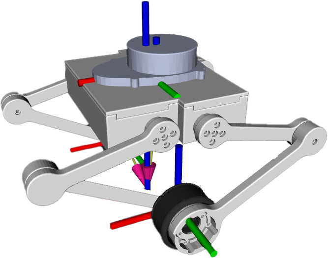

**English | [简体中文](README_cn.md)**
<div id="top"></div>

[![Contributors][contributors-shield]][contributors-url]
[![Forks][forks-shield]][forks-url]
[![Stargazers][stars-shield]][stars-url]
[![Issues][issues-shield]][issues-url]
[![License][license-shield]][license-url]


<!-- PROJECT LOGO -->
<br />
<div align="center">
    <a href="https://github.com/MoonGrt/Wheel_Robot">
    
    </a>
<h3 align="center">Wheel_Robot</h3>
    <p align="center">
    project_description
    <br />
    <a href="https://github.com/MoonGrt/Wheel_Robot"><strong>Explore the docs »</strong></a>
    <br />
    <a href="https://github.com/MoonGrt/Wheel_Robot">View Demo</a>
    ·
    <a href="https://github.com/MoonGrt/Wheel_Robot/issues">Report Bug</a>
    ·
    <a href="https://github.com/MoonGrt/Wheel_Robot/issues">Request Feature</a>
    </p>
</div>


<!-- CONTENTS -->
<details open>
  <summary>Contents</summary>
  <ol>
    <li><a href="#file-tree">File Tree</a></li>
    <li>
      <a href="#about-the-project">About The Project</a>
      <ul>
      </ul>
    </li>
    <li><a href="#contributing">Contributing</a></li>
    <li><a href="#license">License</a></li>
    <li><a href="#contact">Contact</a></li>
    <li><a href="#acknowledgments">Acknowledgments</a></li>
  </ol>
</details>


<!-- FILE TREE -->
## File Tree

```
└─ Project
  ├─ Document
  ├─ Software
  ├─ Tool
  └─ /Hardware/

```


<!-- ABOUT THE PROJECT -->
## About The Project

- [📦 Hardware System Design](#-Hardware-System-Design)
  - [🔋 Power Management Module](#-Power-Management-Module)
  - [🧩 FOC Driver](#-FOC-Driver)
  - [🐞 Link Debugger](#-Link-Debugger)
  - [🧲 Magnetic Encoder](#-Magnetic-Encoder)
- [🔧 Structural Design and Device Selection](#-Structural-Design-and-Device-Selection)
  - [🧱 Housing and Structure](#-Housing-and-Structure)
  - [⚙️ Power System](#-Power-System)
  - [🎯 Sensor Selection](#-Sensor-Selection)
- [💻 Software System Design](#-Software-System-Design)
  - [⚡ FOC Motor Control Subsystem](#-FOC-Motor-Control-Subsystem)
  - [🤖 ROS System Integration](#-ROS-System-Integration)
  - [🌐 Web Console](#-Web-Console)

### Hardware Selection

| Module | Component/Chip Model | Functional Description | Device Parameters |
| ------------ | ---------------------- | -------------------------------------- | --------------------------------------|
| Master | Raspberry Pi | With ROS, responsible for SLAM algorithms | - |
| | STM32F405 | Dedicated to motor control (FOC, PID) | 180MHz, Cortex-M4 core |
| Sensors | AS5147P | Ultra-high-speed Magnetic Rotary Position Sensors | 16-bit resolution, SSI interface |
| | CMP10A | IMU Sensor | 3-axis gyroscope, 3-axis accelerometer, 3-axis magnetometer and barometer |
| | YDLIDAR X3 | LIDAR | 360° scanning, range 0.12-8m |
| POWER MANAGEMENT | LITHIUM BATTERY | - - | 24V, 3000mAh, XT60 socket |
| | TPS54160 + RT9193/LP5907 | 24V→12V/5V→3.3V Two-stage Buck Regulator | TPS54160-Buck, RT9193-VCC, LP5907-AVCC |
| | FSMD012 | Resettable Fuse - Overcurrent Protection | 50A Peak Current |
| | NCP18XH103F0 | Real-time monitoring of the circuit temperature, to prevent overheating damages | 10kΩ B-value -25°C /100°C-3455K |
| | LM5109B + RTP50W | High Speed Half Bridge Driver Control Dissipation Resistor | 5V-18V Driver + 50W Power Resistor, 2ohm |
| | SS34 | Schottky Diode | 3A, 40V, Low Dropout |
| | SMAJ26CA | TVS Diode, Surge Suppression Protection | 30V, Bi-Directional, 400W |
| | 1812 Capacitor × 10 | Decoupling Filter | 50V, 47µF, Ceramic Capacitor |
| Motor Driver | DRV8301 | Brushless DC BLDC Motor Driver Chip | 4.5V-60V, Peak Current 4A |
| | KNY3406C | Field Effect Tubes (MOSFETs) | Vds=40V, Id=60A, Rds(on)=6mΩ |
| | SG995 | Servo, Position Control | 180° Rotation Angle, Torque `13kg.cm @ 6V` |
| | PM3510 | Platform Brushless Motor | 1250rpm 0.11N.m |

### 📦 Hardware System Design

<p align="center" style="margin-top:0px; margin-bottom:0px; margin-left:0px; margin-right:0px; -qt-block-indent:0; text-indent:0px;"></p>

#### 🔋 Power Management Module

The power management module distributes the battery energy, after buck regulator filtering, to the modules of Raspberry Pi, motor driver, sensors (IMU, Lidar, encoder), power system (BLDC motor, servo), etc., to ensure the power supply of each module operates stably.

- **Battery Management System (BMS)**
  - Uses **24V 3000mAh Li-ion battery pack** (XT60 interface) as the main power source.
    - 29.4V 2A charger
  - Built-in intelligent protection board for stable output and longer life:
  - Overcurrent protection: prevents the battery from discharging too much current
  - Short-circuit protection: the product is automatically protected in the event of a short-circuit
  - Over-voltage protection: prevents the battery from charging and discharging too high a voltage
  - Over-charging protection: prevents the battery from being over-charged
  - Over-discharging protection: prevents the battery from being over-discharged
  - Anti-backlash protection: stops the work automatically in case of reverse plugging
  - 10A Button Switch (main switch: for controlling battery charging/discharging; emergency disconnecting the battery) + 16AWG conductor
  - Soldering part is covered with insulating green oil + Heat-shrinkable tubing/insulation tape is used for connecting part of the conductor

- **Voltage Conversion**
  - **Two-stage Bucking Architecture**:
  - Power Supply 24V: Power supply the BLDC motors, BUCK step-down circuits, power supply voltage acquisition circuits, and other modules directly through the power MOS.
    - First stage: TPS54160 (24V→12V, power supply dissipative resistor; 24V→5V: power supply servo, Raspberry, LDO) (Output current 1.5A, switching peak limiting current 1.7~2.3A)
  - TPS54160 Configuration Reference [Texas Instruments Official Design Tools](https://www.ti.com.cn/ product/cn/TPS54160#tech-docs)
  - Stage 2: RT9193 (5V→3.3V, LDO linear regulator, VCC, power supply MCU, encoder chip, motor driver chip), LP5907 (3.3V→5V, voltage regulator, AVCC, power supply analogue end temperature sampling)
  - **Decoupling filter network**: 10 × 1812 ceramic capacitors (50V/47µF) + 1812 ceramic capacitors (63V/47µF)
  - Changing the capacitor closest to the TVS diode to 63V/47µF prevents the capacitor from breaking down due to the surge phenomenon during power-up.
  - **Isolated Ground** - The analogue/power ground is isolated from the digital ground to avoid signal interference.

- **Circuit Protection Design**
  - **Overcurrent Protection**: FSMD012 self-resetting fuse (48V/40A)
  - **Temperature Monitoring**: 10kohm NCP18XH103F0 thermistor (B-value -25℃/100℃-3455K)
  - **Reverse Connection Protection**: SS34 Schottky diode (40V/3A)
  - **Soft Start Protection **: TPS54160 soft-start setting pin external 6.8n capacitor (the larger the capacitance value, the slower the startup)
  - **Transient Suppression**: SMAJ26CA (reverse cutoff voltage (Vrwm): 26V; clamp voltage: 42.1V; peak pulse current (Ipp): 9.5A), bypass resistor (10Ω)
  - Previously used SMAJ30CA with clamp voltage was about 48.4V, the inrush current was so high that the voltage instantaneously rose above the capacitor breakdown voltage before the TVS reacted, causing the capacitor nearest the TVS to break down. (Battery output voltage is 24V~29V)
  - Previously used 3.3Ω resistor with limited inrush suppression
  - **LM5109B** High Speed Half Bridge Driver + **RTP50W** 2Ω/50W Dissipative Resistor to improve motor system stability.
    - Without power dissipation resistors, excess power is charged back to the supply during deceleration to achieve the desired deceleration torque. If the power supply is not able to absorb this energy (which is usually the case with battery power), the bus voltage will inevitably rise. This may cause damage to the switching power supply. In this design, although battery power is used, RTP50W dissipative resistors are still used to improve the stability of the motor system.
    - The power selection of the power resistor depends on your configuration of the motor and the peak power or average deceleration power generated when the motor decelerates. To be safe, you need to consider the speed of the motor and the current the motor can handle. When braking at maximum speed and maximum motor current, the power dissipated in the power dissipation resistor can be calculated as: P_brake = V_emf * I_motor where V_emf = motor_rpm / motor_kv. In this design, using a PM3510 motor with 1250rpm 45rmp/v 0.93A, P_brake = 1250 / 45 * 0.53 = 25.83W.


#### 🧩 FOC Driver

The dual motor FOC driver solution based on STM32F4 series microcontroller supports brushless motor vector control with integrated encoder interface, HALL sensors, CAN communication and multiple peripheral interfaces. It combines a powerful microcontroller with a dedicated driver chip to achieve accurate and highly responsive closed-loop control.

<p align="center" style="margin-top:0px; margin-bottom:0px; margin-left:0px; margin-right:0px; -qt-block-indent:0; text-indent:0px;"></p>

- **Main Functional Modules**
  - **Master Control Unit**
    - **Kernel Chip**: STM32F405VGT6 (ARM Cortex-M4 core, 168MHz, 1MB Flash, 128KB SRAM)
    - **Clock System**: 8MHz Crystal Oscillator
    - **Debug Interface**: SWD (SWCLK/ SWDIO)
    - **Memory**: W25Q32JV SPI Flash
    - **Layer structure**: SIG-PWR-GND-SIG
      - Top layer: Signal layer + copper-laying GND
      - Inside layer 1: small amount of signals + copper-laying VCC
      - Inside layer 2: Power supply layer with copper-laying GND
      - Bottom layer: Signal layer with copper-laying GND
  - **Motor Driver Module**
    - **Driver chip**: DRV8301DCDC **: DRV8301DCAR × 2, support dual motor control
    - **Power Stage**:
      - Pre-Drive Circuit: KNY3406C MOSFET × 12
      - Current Sampling: 0.5mΩ Low Side Resistor
      - Provide Deadband Control, Programmable Gate Drive Capability
  - **Protection Design**:
    - SMAJ30CA TVS Diode
    - 2.2Ω Gate Drive Resistor
  - **Sensor and Feedback**
    - **Position Detection**:
      - Encoder Interface: ENC_A/B/Z signals
      - HALL Sensor Interface: GH/GL/SH/SL signals
    - **Temperature Monitoring**: M0_TEMP/M1_TEMP/AUX_TEMP thermistor interface
    - **Voltage Monitoring**:
  - **Communication Interfaces**
    - **CAN Bus**: SN65HVD232DR transceiver
    - **USB**: CH340K USB to Serial
    - **Expansion Interface**:
      - SPI: MOSI/MISO/SCK/CS
      - I2C: SCL/SDA
      - UART: TX1/RX2
  - **Power Management**
    - **Input Power**:
      - Battery Input: 24V DCBUS BUCK Buck circuit
      - USB power supply: Type-C interface
    - **Voltage regulator circuit**:
      - 3.3V LDO: LP5907MFX-3.3
      - 5V LDO: RT9193-33GB
  - **Filtering design**:
    - Multi-stage LC filtering
    - Ceramic capacitor array

- **Key design features**
  - **Dual-motor architecture**: two independent DRV8301 driver chips Enables dual FOC control
  - **Precision Sampling**:
    - 40nF differential capacitor for current sampling filtering
    - 18kΩ/133kΩ precision resistor network
  - **Safety Protection**:
    - NFAULT Fault Detection Circuitry
    - Dead Time Control (DTC=150kΩ)

- **Physical interface**

<div style="width: auto; display: table; margin: auto;">

| Interface Type | Function Description |
| ----------------|----------------------------|
| FPC-6 P | Download, Debug Interface |
| 2*20 row mother | Raspberry Pi Interface |
| Type-C | USB Communication |

</div>

- **PCB Design Features**
  - Layered Ground Plane: PGND (Power Ground)/AGND (Analogue Ground)/GND (Digital Ground) Separation
  - High Current Path: 1oz Copper Thickness 20~50mil Wide, Copper Cladding to Enhance Heat Dissipation
  - Test Points: TP1-TP6 for easy measurement of critical signals

- **Version**

<p align="center" style="margin-top:0px; margin-bottom:0px; margin-left:0px; margin-right:0px; -qt-block-indent:0; text-indent:0px;"></p>


#### 🐞 Link Debugger
This circuit implements the debugger function based on STM32F103CBT6 microcontroller, compatible with STLink V2 and DAPLink firmware, supporting Type-C USB interface and SWD/JTAG debugging. Main purpose: miniaturisation (11mm x 26mm), portability (combining SWD and UART with FPC-6 interface, easy to connect the debugger to the master instead of connecting them one by one with Dupont cable).

<p align="center" style="margin-top:0px; margin-bottom:0px; margin-left:0px; margin-right:0px; -qt-block-indent:0; text-indent:0px;"></p>

- **Main Module**
  - **Power Supply Module**
    - **LDO Circuit**: 5V to 3.3V (Model 662K)
    - **Filter Capacitor**: Input: 1µF; Output: 100nF
    - **Power Indicator**
    - **Power Supply Protection**: BSMD0805-100-6V, PPTC Self-Recovering Fuse for overcurrent prevention.
  - **Master Chip**
    - **Ctrl Unit**: STM32F103CBT6 (72MHz, 128KB Flash, 64KB SRAM)
    - **Clock Source**: 8MHz crystal with 22pF load capacitor
  - **Peripheral Circuitry**
    - **Reset Circuitry**: 10kΩ Pull-up Resistor + 100nF Filter Capacitor
    - **LEDs Indicator**: Power indicator, debug status indicator, serial communication indicator
    - **Power Acquisition**: Acquisition of half of the voltage value of the power supply to the ADC input to the MCU
  - **Connector**
    - **USB Interface**: Type-C USB interface
    - **FPC Interface**: 6Pin, UART+SWD interface,
    - **Debug Interface**: 4Pin SWD standard interface for firmware burning for debugger
- **Special Design**
  - **DTC143ZCA**: digital transistor: used to detect whether VBUS is valid or not, so as to control the USB_RENU signal
  - Resistors such as R10, R15, and R13 are used in conjunction with Q1, to form a simple voltage detection and pull-down control. When VBUS detects 5V, Q1 conducts and USB_RENU is pulled high (or low), prompting the MCU for ‘USB insertion detection’.

#### 🧲 Magnetic Encoder
Non-contact encoder with high precision magnetic rotary position sensor design, compatible with AS5147P, AS5047P, suitable for motor position detection, supports multiple output modes, with anti-interference and high temperature working characteristics.AS5147P comes with an LDO, so no extra LDO is needed.(Main function: connect/ (Main functions: connecting/welding encoder chip, supplying power to encoder chip - power protection, providing encoder interface to master control for connection)

<p align="center" style="margin-top:0px; margin-bottom:0px; margin-left:0px; margin-right:0px; -qt-block-indent:0; text-indent:0px;"></p>

- **Core Features**
  - **Resolution**: 14-bit absolute position output (0.022° accuracy)
  - **Interface Support**:
    - SPI (SCK/SDI/SDO/CS)
    - ABZ
    - UVW
    - PWM Pulse Width Modulation
  - **Operating Voltage**: 3.3V/5V Wide Voltage Compatible
    - Provide DIP switches for user to select input voltage mode
  - **Mechanical characteristics**: 360° contactless rotation detection
- **Hardware Design Points**
  - **Anti-Interference Design**
    - Power Filtering: 100nF ceramic capacitors in parallel
    - Signal Isolation: Magnetic Grids are laid out orthogonally to PCB alignment
  - **Protection Design**
    - SMFJ5.0A: Static and Surge Protection (TVS/ESD)
    - LEDs: Indicates the power supply status
  - **Size Design**: Combined with the Mechanical design, to be embedded in the housing, size 26mm

---

### 🔧 Structural Design and Device Selection

<p align="center" style="margin-top:0px; margin-bottom:0px; margin-left:0px; margin-right:0px; -qt-block-indent:0; text-indent:0px;"></p>

#### 🧱 Housing and Structure
- **3D printed housing**
  - Structure: modular assembly with quick release interface for easy maintenance and function expansion.
  - Internal reserved battery compartment, circuit board fixing holes, heat dissipation design.
  - Reserve 0.2mm tolerance between structural parts
  - Base:
    - Material: X resin (large parts, cost saving)
    - Thickness: 3mm
    - Structure:
      - Middle assembly tabs to fix the main control board and driver board
      - Fixed servos on both sides
      - Front and back openings to expose the main control board, driver board interface, and knob switch fixing holes.
      - Bottom: Sinking in the middle to fix the IMU module; both sides are reserved for the slots of the Battery Case.
      - Reserved threaded holes and countersunk holes for bolts
  - Cover:
    - Material: X resin (large part, cost saving)
    - Thickness: 3mm
    - Structure:
      - Base fixing holes
      - Assembly tabs to fix ydlidar, sunk in the middle to fix ydlidar driver board
      - Reserved threaded holes and countersunk holes for bolts
  - Battery Case:
    - Material: X resin (large part, cost saving) - Thickness: 3mm Cost saving)
    - Thickness: 3mm
    - Structure:
      - middle sunken to fix the battery
      - both sides partly upward to form the snap with Base
      - front and back right upper corner open hole, reserved for battery cable
      - reserved threaded holes, countersunk holes for bolts for connecting
  - Arm:
    - Material: PLA
    - Thickness: 8mm
    - Structure:
      - fix the servo and Motor Case
      - Arm inter-bearing connecting
      - reserved space for motor cables, encoder cables Space
      - Distance between control motor radial magnet and encoder (<1mm)
      - Reserved threaded holes, countersunk holes for bolts for connection
  - Motor Case:
    - Material: PLA
    - Thickness: 3mm
    - Structure:
      - Fixed Motor, Magnetic Encoder
      - Reserved space for bearings
      - Outer recessed, reserved space for rubber ring
      - Reserved threaded holes, countersunk holes for bolts for connection

#### ⚙️ Power System

- **Brushless DC motor**
  - Model: **PM3510**
  - Parameters: 1250rpm, 0.11N-m, 45 rmp/v, Driver chip DRV8301.
  - Note:
  - Motor radial magnet needs to be replaced (the original motor radial magnet has a poor magnetism, which results in a noisy encoder).
    - When installing a stronger encoder magnet, the distance between the magnet and the encoder in the mechanical design should be considered.
- **Servo**
  - Model: **SG995**
  - Parameters: 20ms, 180°rotation angle (500-2500), 13kg-cm Torque (@6V), 100mA.
  - Note:
    - Pay attention to the initial angle when installing, to avoid the wrong rotation direction.

#### 🎯 Sensor Selection

##### **AS5147P High-Speed Rotary Position Sensor**

- **Product Overview**
  - **AS5147P** is a CMOS technology-based 14-bit, high-resolution, axial-magnetic rotary position sensor designed for high-speed applications up to **28,000 RPM**, providing complete ** 360° absolute angle measurement**. It incorporates advanced **Dynamic Angular Error Compensation (DAEC™)** technology, which effectively suppresses angular errors caused by system delays to achieve a virtually **zero delay output**.
  The AS5147P also features a **12-bit incremental binary output interface (ABI)** with a resolution of up to **4096 steps/1024 pulses per revolution**, which is suitable for encoder systems. Through the standard **4-wire SPI interface**, the master device can read the high-precision angular information output from the sensor, and supports programmable non-volatile configurations without the need for an external programmer.

- **Key features**

  <div style="width: auto; display: table; margin: auto;">

  | Feature Category | Description |
  |--------------------|-------------------------------------------------------------|
  | **Resolution** | 14-bit Absolute Angle-SPI<br>12-bit Incremental Encoding (ABI: 1024/2048/4096) |
  | **Speed Support** | Up to **28,000 RPM** for high speed rotation detection |
  | **Output Interfaces** | SPI, ABI, UVW commutation signals, PWM Duty Cycle encoded outputs |
  | **Dynamic Angle Compensation** | DAEC™ Dynamic Angle Error Compensation (for SPI, ABI, UVW outputs, enhancing real-time) | | **Dynamic Angle Compensation** | DAEC™ Dynamic Angle Error Compensation (for SPI, ABI, UVW outputs, enhancing real-time) |
  | **Anti-Interference Capability** | Suppresses uniform stray magnetic field interference and improves system stability |
  | **Non-Volatile Configuration** | SPI interface programmable, no need for dedicated programmer |
  | **Self-Diagnostic Functions** | Detects magnetic field strength abnormalities (too strong/too weak/absent), device status abnormalities, etc. |
  | **Interpolation and Signal Integrity** | Interpolates missing ABI pulses at high speeds to ensure resolution and signal continuity. Interpolation and Signal Integrity**| Interpolates missing ABI pulses at high speeds to ensure resolution and signal continuity.

  </div>

  - **Technical Principles and Architecture** 
    - The AS5147P utilizes an array of **Hall effect sensors** that convert magnetic field components into voltage signals by sensing the magnetic flux density perpendicular to the chip surface. After amplification and filtering by an analog front end (AFE), these signals are fed into an analog-to-digital converter (ADC) and then processed by the CORDIC algorithm to accurately calculate the angle and amplitude of the magnetic vector. In addition, the AS5147P 
      - **Automatic Gain Control (AGC)** mechanism: real-time adjustment of the front-end gain to adapt to changes in magnetic field and temperature 
      - **CORDIC Algorithm Module**: calculates the angle of rotation and the amplitude of the magnetic field 
      - **Interpolation Mechanism**: completes the missing pulse of the ABI at high speeds to ensure the continuity of the output signals 
    - The AS5147P has a **Dynamic Angular Error Compensation (DAEC™)** function. The AS5147P features **Dynamic Angle Error Compensation (DAEC™)**, which improves real-time performance of the SPI, ABI, and UVW outputs by estimating the time delay during angle measurements and predicting and compensating for the angular output error accordingly. This compensation is particularly effective at constant speeds.


##### **YDLIDAR X3 LIDAR** 

The YDLIDAR X3 is a high-performance, compact 2D LiDAR (LiDAR) product that utilizes the principle of triangulation and combines advanced optical, electrical and algorithmic design to enable **360-degree omni-directional environmental scanning and high-precision distance measurement**.

- 🌐 Core Functions Overview 
  - 🔄 **360° Omni-directional Scanning and Distance Measurement** 
  YDLIDAR X3 is equipped with a rotary motor, which is capable of realizing **complete 360-degree rotations in the horizontal plane**, and real-time outputting the distance measurement data of the corresponding angle in each rotation to form a high-density 2D point cloud map. This means that it is capable of **panoramic perception of its surroundings** and can obtain complete spatial information without moving the platform itself.
  - 🎯 **High-precision and high-frequency ranging performance** 
  The radar achieves a ranging capability of up to **4,000 times per second** (typical) through the mechanism of transmitting high-frequency laser pulses and receiving them as echoes, ensuring smooth, detailed perception even in fast-moving environments.
    - **Typical ranging accuracy: ±2cm (≤1m)** 
    - **Relative error: minimum 1%, and within 3.5%~5% at long distances** 
  - ☀️ **Strong resistance to interference from ambient light** 
  The YDLIDAR X3 possesses good resistance to interference, and can work stably under natural light or artificial light. Whether it is bright daylight exposure or indoor lighting strobe, it can maintain stable output to ensure the reliability of ranging data.
  - 🔋 **Low power consumption, small size, long life** 
  The product design focuses on energy saving and portability, with low energy consumption operating characteristics, and adopts a long-life rotating structure and optoelectronic components, which is suitable for long-term deployment in a variety of smart devices.
  - ⚙️ **Motor speed is adjustable to suit different needs** 
  Users can adjust the scanning frequency from **5Hz to 10Hz** according to the application needs, balancing the measurement accuracy and real-time performance. For example: 
    - **5Hz: the angular resolution can be up to 0.6°**, suitable for scenarios requiring high accuracy (e.g. map building) 
    - **10Hz: the angular resolution is 1.2°**, which is more suitable for tasks requiring higher real-time performance (e.g. obstacle avoidance) 

- ⚙️ Performance Parameters

  <div style="width: auto; display: table; margin: auto;">

  | Item | Minimum | Typical | Maximum | Unit | Remarks | 
  | ------------------ | -------- | -------- | -------- | ------ | ---------------------------- | 
  | Ranging Frequency | / / | 4000 | / | Hz | Ranging per second max. 4000 times | 
  | Scanning Frequency | 5 | 8 | 10 | Hz | Motor Adjustable | 
  | Ranging Range | / | 0.12/8 | / | m | 10%/80% Reflective | 
  | Scanning Angle | / | 0-360 | / | ° | Rotation of 360° | 
  | Absolute Error of Ranging | / | 2 | / | cm | ≤1m range | 
  | Relative Error | / | 1% | 5% | / | Maximum Relative Error in 8m distance | 
  | Angle Resolution | 0.6 | 0.96 | 1.2 | ° | corresponds to 5Hz/8Hz/10Hz respectively | 
  | Pitch | 0.25 | 1 | 1.75 | ° | Bound Angle control range |

  </div>


##### **CMP10A-IMU Inertial Measurement Unit**

CMP10A is a high performance 3D motion attitude measurement system based on MEMS technology. It contains three-axis gyroscope, three-axis accelerometer, three-axis electronic compass motion sensor and barometer. Through the integration of various high-performance sensors and the use of self-developed attitude dynamics core algorithm engine, combined with high-dynamic Kalman filter fusion algorithms, to provide customers with high-precision, high-dynamic, real-time compensation of the three-axis attitude angle, through the flexible choice of configuration of various types of data, to meet the different application scenarios.

- **Product Features**
  - The module integrates high-precision gyroscopes, accelerometers, geomagnetic field sensors and barometers, and adopts a high-performance microprocessor and advanced dynamics solving and Kalman dynamic filtering algorithms, which are able to quickly solve the current real-time motion attitude of the module.
  - The advanced digital filtering technology can effectively reduce the measurement noise and improve the measurement accuracy.
  - Module internal integrated attitude solver, with dynamic Kalman filtering algorithm, can accurately output the current attitude of the module in the dynamic environment, attitude measurement accuracy of static 0.05 degrees, dynamic 0.1 degrees, the stability is very high, the performance is even better than some professional inclinometer.
  - The Z-axis heading angle is fused with geomagnetic sensor filtering, which solves the cumulative error caused by the drift of the gyroscope integral in the 6-axis algorithm, and can output the heading angle data stably for a long time. Note: It needs to be calibrated before use due to magnetic field detection, and it needs to be kept at least 20cm away from magnetic interference areas, electronic devices, magnets, speakers and other hard magnetic objects.
  - Module comes with internal voltage stabilisation circuit, working voltage 3.3~5V, pin level compatible with 3.3V/5V embedded systems, easy to connect.
  - Supports both serial and IIC digital interfaces. Convenient for users to choose the best way to connect. Serial rate 4800bps~921600bps adjustable, IIC interface support full speed 400K rate.
  - Maximum 200Hz data output rate. Output content can be freely selected, output rate 0.2 ~ 200Hz adjustable.

- **Sensor parameter indicators**

  <div style="width: auto; display: table; margin: auto;">

  | Sensor Type | Parameters | Conditions | Typical |
  | ------------ | ------------ | -------------------- | -------------------------- |
  | Accelerometer | Range | | ±16g |
  | | Resolution | ±16g | 0.0005 (g/LSB ) |
  | | RMS Noise | Bandwidth = 100Hz | 0.75~1 mg-rms |
  | | Stationary Zero Drift | | Horizontal Positioning | ±20~40 mg |
  | | Temperature Drift | -40°C ~ +85°C | ±0.15 mg/°C |
  | | Bandwidth | | 5~256 Hz |
  | Gyro Gauge | Range | | ±2000 °/s |
  | | Resolution | ±2000 °/s | 0.061 (°/s)/LSB |
  | | RMS Noise | Bandwidth=100Hz | 0.028~0.07 (°/s)-rms |
  | | Stationary Zero Drift | Horizontal Placement | ±0.5~1 °/s |
  | | Temperature Drift | -40°C ~ +85°C | ±0.005~0.015 (°/s)/°C |
  | | Bandwidth | | 5~256 Hz |
  | Magnetometer | Range | | ±2 Gauss |
  | | Resolution | ±2 Gauss | 0.0667 mGauss/LSB |
  | Barometer | Range | | 300~1100 hPa |
  | | RMS Noise | Standard Mode | 0.5 Pa-RMS |
  | | Relative Accuracy | | ±0.06 hPa |

  </div>


#### **structural connections**
bearings rolled tape insulating tape wires conductors bolts nuts rubber rings (tyres) 502 glue

---

### 💻 Software System Design

<p align="center" style="margin-top:0px; margin-bottom:0px; margin-left:0px; margin-right:0px; -qt-block-indent:0; text-indent:0px;"></p>

#### ⚡ FOC Motor Control Subsystem

##### RT-Thread RTOS
Realisation of task isolation: control thread, current sampling thread, communication thread run independently;


- 🟦 **Initialisation phase**
  - Starting from `System Startup`:
  - **Load Configuration Parameters from NVM**: Used to load previously saved system parameters such as motor configurations, calibration data etc.
  - **System initialisation**: divided into three key sections:
    - `GPIO/PWM/USB/SPI/DMA` and other peripherals initialisation.
    - Interrupt configuration, including interrupt priority setting, registering ISR.
    - RTOS (Real-Time Operating System) initialisation, starting the scheduler, memory stacks, etc.
  - Finally, creating the main thread and starting the scheduler.
- 🟩 **Main thread running logic**
  - **Starting peripherals**: e.g. PWM outputs, current sampling ADCs, timers, etc.
  - **Create three auxiliary threads**:
    - **Communication processing threads**: USB/CAN/UART receive, status upload.
    - **System monitoring threads**: such as temperature, voltage monitoring and fault detection.
    - **Motor status management thread**: periodic update of the operating status of each axis.
  - The main thread exits when the task is completed and the system enters the real-time operation state.
- 🟨 **Real-time operation phase**
  - **Communication thread (H1)**
    - Handles USB/CAN/UART commands.
    - Report status data.
    - Parses control commands, updates control targets, and enters the control chain (associated with the control core).
  - **System Monitoring Thread (H2)**
    - Periodically collects temperature, voltage, error flags, etc. Performs anomaly detection.
    - Performs anomaly detection and reports to `Error Handling D1` when problems are found.
  - **Motor Status Management Thread (H3)**
    - Periodically refreshes motor status and feeds back to the control system.
    - Transmits operating mode changes, error messages, etc.
- 🟪 **Core Control Chain**: This is the ‘heart’ of the control system, driven by the timer interrupt:
  - High-precision timer interrupt triggered → control cycle starts.
  - Start the soft interrupt to execute the control logic:
    1. **Sampling data**: Read encoder, current sensor, etc. 2.
    2. **Execute control algorithm**: including closed-loop control of position, speed, current.
    3. **Update PWM**: output to motor drive.
    4. **Cycle safety check and status reset**.
  - If an abnormality is detected, it will immediately enter `Error Interrupt Processing` and shutdown/protection.
- 🟧 **Auxiliary Interrupt Module**: interrupt events that supplement the control logic:
  - **Communication Interrupts**
    - Receives USB/CAN external control data, writes it to the command queue, and later parses and executes it by the communication thread.
    - UART DMA interrupt
  - **GPIO interrupt**
    - Detects e.g. `DRV8301 nFAULT` fault signal.
    - Z-phase encoder interrupt for one-time calibration (e.g., home alignment).
  - **Timer interrupt**
    - Encoder edge capture, PWM width capture for RPM and position measurement.

- Note:
  - Note why the thread performs the control and uses a timer interrupt?


##### PID Regulation Flow - FOC Algorithm

The control algorithm uses a three-level closed-loop architecture with position control, speed control and current control in order from top to bottom. The control thread receives new input commands, reads the encoder and current sensor feedback, executes each level of the PID algorithm, and updates the control output in each control cycle. The entire process is embedded with measures such as anti-integral saturation, limiting, gain scheduling, and anti-groove calibration to ensure high accuracy and robustness.

- **Overall flow of the control chain**
  ```mermaid
  graph LR
    A[Incoming target command from host computer<br>Position/Speed/Current] --> B[Input processing & trajectory planning<br>Multi-mode filtering/Trap Traj / Mirror etc.]
    B --> C[Position Loop: compares the target position with the current encoder or estimate and calculates the positional error]
    C --> D[Generate additional speed expectations based on P-control and anti-alveolar compensation etc.]
    D --> E[Speed loop: compare desired speed from position loop with actual speed to calculate torque or current expectations using PI structure]
    E --> F[Conversion: torque expectation is calculated from motor output via PI structure speed expectation]
    D --> E[Velocity loop: compare desired speed from position loop output with actual speed<br>Calculate torque or current expectation using PI structure]
    E --> F[Conversion: torque expectation is converted to current expectation by motor parameters and torque constants<br>ACIM-type motors need to be scaled by flux]
    F --> G[Current Loop: access to the d-q coordinate system, control current error using the PI algorithm PI algorithm to control current error]
    G --> H[Voltage command calculated and converted by SVPWM module to generate PWM waveform]
  ```

  Of these:
  - **Input Processing** Updates the internal setpoint according to the different input modes (Passthrough, speed/torque ramping, trajectory planning, etc.) and filters the loop bandwidth, limits, etc.
  - **Position loop** In position control mode, only proportional feedback (pos_gain) is used in conjunction with loop drift correction, notch compensation, etc.
  - **Velocity loop** In addition to multiplying the velocity gain (vel_gain) to obtain a preliminary torque command, an integral term (vel_integrator_torque_) is introduced for error accumulation, and windproof control (gain scheduling and anti-saturation measures) is used.
  - The **current loop**, on the other hand, performs PI modulation of the d-q current error within the Field Oriented Control module, with the integral state limited by the saturation condition of the modulation vectors and combined with feed-forward terms (e.g., reverse potential, R/L feed-forward) to guarantee the system response.

- **Schematic of control chain operation**
  The interaction between the control thread and the peripherals and ADC/FOC interrupts can be summarised as:

  ```mermaid
  graph TD
      %% Node definitions
      subgraph S1[🟦 Underlying Data]
          Sensors[Sensor Node<br/>IMU, Laser, Odometry]:::sensor
          WheelRobot[Wheel Robot Node<br/>Publishes robot description and tf]:::sensor
      end

      subgraph S2[🟩 Functional Modules]
          MotionCtrl[Motion Control Node<br/>Subscribes to IMU / Listens to cmd_vel]:::module
          Cartographer[Cartographer Node<br/>Map building and map publishing]:::module
      end

      subgraph S3[🟨 External Interfaces]
          WebService[Web Service<br/>Sends cmd_vel / Subscribes to map]:::external
      end

      %% Data flow connections
      Sensors -- IMU/Laser/Odom Data --> Cartographer
      Sensors -- IMU Data --> MotionCtrl
      WheelRobot -- Robot Description/TF --> Cartographer

      WebService -- cmd_vel Control Command --> MotionCtrl
      MotionCtrl -- Motion Control Feedback --> Cartographer
      Cartographer -- map Data --> WebService

      %% Style settings
      classDef sensor fill:#cce5ff,stroke:#3399ff,stroke-width:2px;
      classDef module fill:#d4edda,stroke:#28a745,stroke-width:2px;
      classDef external fill:#fff3cd,stroke:#ffc107,stroke-width:2px;
  ```

  In this process:
  - **Input Processing**: not only includes direct setpoint transmission, but also includes various logics such as filtering, slope updating, Trap Traj interpolation, mirror mode, etc.
  - **Feedback from each link**: Position and speed errors affect low and medium frequency control respectively, while the current loop operates at higher frequencies to ensure timely response of the entire closed loop.
  - **Error protection and monitoring**: Sensor validity, limit status and power mismatch are constantly detected inside the control thread, and protection is triggered in case of abnormality (e.g. shutdown or error reporting).

- **Position loop** PID (slow closed loop)
  - **Inputs**: target position (pos_setpoint) vs. actual position (encoder / PLL or sensorless estimation).
  - **Outputs**: generation of a correction value for the target velocity (vel_setpoint).
  The position loop is often purely proportional (P-control), and should cycle the cyclic setpoints. In some modes, anti-groove calibration data is also superimposed on the error correction.

  ```cpp
  // Note: the actual code distinguishes between linear and cyclic setpoints,
  // and introduces both drift prevention and gain scheduling (which reduces the feedback gain when the error is small).
  float pos_error = pos_setpoint - pos_estimate;
  if(config_.circular_setpoints) {
      pos_error = wrap_pm(pos_error, pos_wrap_value);
  }
  vel_setpoint = vel_setpoint_base + config_.pos_gain * pos_error;
  ```

- **Speed loop** PID (medium speed closed loop)
  - **Inputs**: desired speed generated by the position loop (with position P compensation), actual speed (from encoder / PLL output).
  - **Output**: calculation to obtain a torque expectation, which is converted to represent the current (iq_setpoint).
    The implementation uses a PI control structure, where the integral term is protected against saturation (e.g. limiting or attenuation). The sample code concept is shown below:

  ```cpp
  float vel_error = vel_desired - vel_estimate;
  vel_integrator_torque_ += (vel_integrator_gain * vel_error * dt);
  vel_integrator_torque_ = std::clamp(vel_integrator_torque_, -config_.  vel_integrator_limit, config_.vel_integrator_limit);
  // Here it is also possible to combine gain scheduling: lowering the P-action at small errors (gain_scheduling_multiplier)
  float torque = torque_setpoint + (vel_gain * gain_scheduling_multiplier * vel_error) + vel_integrator_torque_;
  ```

  Among them:
  - **Input modes**: different modes (e.g. VEL_RAMP, TRAP_TRAJ, MIRROR, TUNING, etc.) determine how the pos_setpoint/vel_setpoint/torque_setpoint is updated;
  - **Limiting mechanism**: ensures that the system output does not exceed the safe range by limiting the torque and vel_ setpoint to ensure that the system output does not exceed the safe range;
  - **Error detection**: triggers an error condition immediately when, for example, overspeed error or spinout (electromechanical power mismatch) is detected.

- **Current loop** PID (FOC control, high speed closed loop)
  - **Inputs**: target current (iq_setpoint and (optionally) id_setpoint) and measured current (Iq, Id sampled by ADC and transformed by Clarke / Park).
  - **Output**: Voltage command in d-q coordinate system calculated by PI control (including feed-forward term), then converted to PWM waveform by inverse Park transform and SVPWM algorithm. The sample code concept is as follows:

  ```cpp
  // Take the Iq component as an example (Id generally holds or tracks a predetermined value, depending on the algorithm and motor type)
  float Ierr_q = iq_setpoint - iq_measured;
  v_current_control_integral_q_ += Ierr_q * (i_gain * dt);

  // If overmodulation is detected (output vector amplitude exceeds limits), the integration term is attenuated (protection against integration storms)
  float mod_scalefactor = /* Scaling factor calculated from current output modulus */;
  if (mod_scalefactor < 1.0f) {
      // Lockout or decay points
      v_current_control_integral_q_ *= 0.99f;
  }
  vq = Vq_feedforward + (p_gain * Ierr_q + v_current_control_integral_q_);
  ```

  This is followed by an inverse Park transform and SVPWM algorithm similar to the one below:

  ```cpp
  // Convert mod_d, mod_q in d-q coordinates to α-β coordinates.
  float c_p = cos(pwm_phase);
  float s_p = sin(pwm_phase);
  float mod_alpha = c_p * mod_d - s_p * mod_q;
  float mod_beta = c_p * mod_q + s_p * mod_d;

  // SVM module maps (mod_alpha, mod_beta) to PWM timings (tA, tB, tC)
  auto [tA, tB, tC, success] = SVM(mod_alpha, mod_beta);
  ```

  - Note: The current control state is used for feedforward and load prediction in the actual control, taking into account R/L and feedforward compensation of the reverse electromotive force, which is reflected in the code in Motor::update() and FieldOrientedController::get_alpha_beta_output().

  > **Additional Notes**:
  > - All the PID parameters for each link (e.g. pos_gain, vel_gain, vel_integrator_gain, current loop p_gain, i_gain, etc.) are loaded from the NVM during system initialisation, and parameter tuning directly affects closed-loop dynamics and stability.
  > - In addition, the input modes (e.g. TRAP_TRAJ for trajectory planning mode) and anticogging measures are also preprocessed at the setpoint before the PID control chain, thus ensuring smooth and robust control instructions.


##### Driver Development
- **Encoder (ASA5147P)**: supports multiple types including: SPI, ABI, UVW, PWM; this motor driver supports two modes:
  - ABZ mode: uses the encoder mode of the stm32F4 timer peripheral, reads the position and speed feedback from the motor encoder
  - SPI mode: directly reads the ASA5147P's registers with higher 14-bit precision
- **FLASH (W25Q32JVSSIQ)**: for storing parameters, configurations, etc.;
- **Motor Driver (DRV8301)**
  - SPI Initialisation, Configuration Chip
  - Using stm32F4 advanced timer TIM1 TIM8: for 3-phase motor drive, reducing EMI; Complementary PWM output with dead time configuration (force PWM to be 50% during count down) to prevent short-circuiting of the upper and lower bridge arms straight through
- **Servo Driver (SG995)**: PWM mode of TIM2 to control the servo's angle.


##### Communication protocols
- **USB CDC/HID** **CAN bus**
  - fibre stack: a set of application layer protocols used for communication between the upper and lower units. The corresponding communication protocol stack is generated according to the contents of the ymal file.
  - Data type: format of packet Format of stream
- **UART Serial port**: to communicate with external sensors or Raspberry Pi.
  - Serial communication protocol: UART 921600 8N1, ASCII format; sends motor position and speed information continuously at 100Hz.

##### Configuration Tool UI
- **Parameter Configuration Tool**
  - QT-based visualisation interface;
  - Visual parameter tuning: motor pole-pair number, encoder CPR, brake resistance settings ......;
  - One-click calibration: measurement of the motor's electrical characteristics (i.e., motor phase resistance and phase inductance), as well as encoder offset calibration;
  - Real-time monitoring : Voltage, current, temperature feedback.
  - **Note**: The platform brushless motor used in this project is
- **PID Configuration Tool**: further unleash the performance of the FOC driver board. By adjusting the PID parameters, the controller can quickly respond to disturbances or changes in the system (e.g., applied external forces or changes in setpoints) without becoming unstable, which ensures that the motor driver board is able to control the motor in the most efficient way.
  - QT-based visualisation interface;
  - Real-time monitoring: position and speed feedback;
  - Sliders: visual adjustment of the PID parameters;
  - **Experience**: first set the Ki of the speed loop to 0 and the Kp of the position loop to a relatively small value. Gradually increase the Kp of the velocity loop by about 30% per iteration until the motor vibrates. In reality, as Kp increases, the current sound gets louder and louder and eventually vibrates at high frequency. Back off the Kp of the velocity loop to 50% of the vibration value and then set the integrator to 0.5 * bandwidth * vel_gain, where bandwidth is the total tracking bandwidth of the system. For this project, bandwidth was 10 hz. set the Ki of the velocity loop = 0.5 * 10 * vel_gain according to the formula. subsequently, gradually turn up the position loop Kp until some overshoot is seen. Back off the position loop Kp until there is no more overshoot. Debugging can be done by giving a Kp and then a position target to see the step response.
  - **Note**: Tests have found that the magnitude of the current sound has nothing to do with the Kp of the position loop, and everything to do with the Kp of the velocity loop; reduce the velocity loop Kp, and the current sound will be much smaller. It is reasonable to say that the larger the Kp of the position loop, the more overshoot, but actually found that the Kp is relatively small, the motor is very soft, at this time instead of overshoot. I feel that because the motor is too soft at this time, to the target position is a little out of control.

---

#### 🤖 ROS System Integration

##### 🧪 Simulation Platform Construction
The SLAM simulation platform is built first, which facilitates rapid algorithm verification and parameter debugging. The capacity of the physical battery is limited, and it is easy to damage to affect the project progress.

- **URDF**: robot model structural modeling;
  - **sw_urdf_exporter tool**: https://github.com/ros-industrial/sw_urdf_exporter
    - coordinate parameterization of solidworks modeling, use the tool sw_urdf_ exporter to convert the results to URDF format;
    - difficult to simulate a wheel-footed robot directly, here it is simply converted into a two-wheeled differential model for testing;
    - the tool will automatically calculate the mass and moment of inertia based on the model material and generate the corresponding STL file.
  - **Wheel_Robot**: base_link, laser_link, imu_link, left_wheel_link, right_wheel_link
    - base: fixed imu, laser_link, 8 arm (simplified model) : fix the arm directly on the base, can't move up and down
      - Mass: 0.459 kg, the main part of the robot.
      - Inertial origin: at (-0.00238, 0, 0.0969), probably due to design center of gravity shift.
      - Geometry and collisions: both defined using the base_link.STL file.
    - laser:
      - mass: 0.0866 kg, lightweight design.
      - Mounting position: fixed to base_link at (-0.0005, 0, 0.1246) by laser_joint.
      - Function: LIDAR sensor on top of the robot.
    - imu:
      - mass: 0.00216 kg, very light.
      - Mounting position: Fixed to base_link at (-0.01, 0, 0.0946) by imu_joint.
      - Function: Inertial measurement unit, near the center of the base, for attitude detection.
    - wheel:
      - Mass: about 0.01686 kg, symmetric design.
      - Geometry and collision: both use left_wheel_link.STL and right_wheel_link.STL.
      - Mounting position:
        - Left wheel: (0, 0.0655, 0.02596), rotating around y-axis (axis="0 1 0").
        - Right wheel: (0, -0.0655, 0.02596), rotating around the y-axis in the negative direction (axis=“0 -1 0”).
        - Wheel spacing: 0.174 m (symmetrically distributed on both sides of base_link).


<p align="center" style="margin-top:0px; margin-bottom:0px; margin-left:35px; margin-right:0px; -qt-block-indent:0; text-indent:0px;"></p>

- **Gazebo**: to realize the full simulation environment;
  - **gazebo plugin**: to add the plugin to the generated urdf plugin in order to generate the sensor data that the simulation environment allows to be needed;
  - **1. Differential Drive Plugin (`diff_drive`)**: to realize the differential drive control with the odometer release.
    - **Wheel_separation**: `0.174 m`
    - **Wheel_diameter**: `0.026 m`
    - **Maximum Torque & Acceleration**: `20 N-m` and `1.0 rad/s²` for small robots but need to be adjusted according to actual motor performance.
    - **TF Publishing**: `publish_odom_tf` is set to `true` to make sure the `odom` → `base_link` coordinate transformation is working.
  - **2. Joint state publishing plugin (`joint_state`)**: publish left and right wheel joint states to `/joint_states`.
    - **Update frequency**: `30 Hz`, consistent with the differential drive plugin, reasonable.
    - **Joint names**: correctly associate `left_wheel_joint` and `right_wheel_joint`, matches URDF.
    - **TF Publishing**: robot_state_publisher node runtime publishes coordinate transformations for `base_link` → `left_wheel_link` and `base_link` → `right_wheel_link`.
  - **3. IMU Sensor Plugin**: configures IMU sensors and publishes IMU data.
    - **Noise model**: add Gaussian noise for both angular velocity and linear acceleration to match the real IMU characteristics.
      - **Angular velocity noise**: standard deviation `2e-4 rad/s`, slight jitter, reasonable.
      - **Linear acceleration noise**: standard deviation `0.017 m/s²`, deviation mean `0.1 m/s²`, simulated zero-bias drift, consistent with low-cost IMU characteristics.
    - **Update frequency**: `100 Hz`, meets most SLAM algorithm requirements.
    - **TF Publishing**: robot_state_publisher node runtime publishes `base_link` → `imu_link` coordinate transformations.
  - **4. laser radar (LiDAR) plugin**: configure LiDAR and publish LiDAR data.
    - **Scanning parameters**: 360° scanning, `1°` resolution, `3.5 m` maximum range, `0.12 m` minimum, for indoor environments.
    - **Noise**: Gaussian noise (`stddev=0.01 m`), analog measurement error, reasonable.
    - **Publishing frequency**: `5 Hz`, low, may affect the real-time obstacle avoidance, it is recommended to upgrade to `10-20 Hz`.
    - **Installation position**: <pose>`0 0 0.075 0 0 0</pose> 0`, offset relative to `laser_link` needs to be superimposed with the actual height of the LIDAR in the URDF (`z=0.1246 m`) to ensure that the final position is correct.
    - **TF Publishing**: robot_state_publisher node runtime publishes the `base_link` → `laser_link` coordinate transformation.
  - **Simulation Scenarios**:
    - Scenario 1: [willowgarage](Software\ROS\wheel_robot_sim\src\wheel_robot\worlds\willowgarage.png)
      - Willow Garage The office environment is a classic simulation scenario used to testing robot navigation, SLAM and human-robot interaction algorithms.
    - Scenario 2: [cafe](Software\ROS\wheel_robot_sim\src\wheel_robot\worlds\cafe.png)
      - Cafe World is a simulation of a cafe scene designed to test robot navigation, SLAM and human-robot interaction algorithms in a dynamic environment.
    - Compare the two

        <div style="width: auto; display: table; margin: auto;">

        | **Features** | **Willow Garage** | **Cafe World** |
        |------------------------|---------- -------------------|-----------------------------|
        | **Scene Types** | Office Environment | Service Scene (Cafe) |
        | **Dynamic Elements** | Static Obstacle Oriented | Dynamic Pedestrians + Movable Objects |
        | **Testing Focus** | Navigation, SLAM | Human-Computer Interaction, Obstacle Avoidance | | **Complexity** | Medium (structured layout) | High (lots of dynamic interference) |

        </div>


<p align="center" style="margin-top:0px; margin-bottom:0px; margin-left:35px; margin-right:0px; -qt-block-indent:0; text-indent:0px;"></p>

<p align="center" style="margin-top:0px; margin-bottom:0px; margin-left:35px; margin-right:0px; -qt-block-indent:0; text-indent:0px;"></p>


- **Cartographer + Navigation2**: Realize map building and navigation path planning.
  - Map building: **Cartographer**;
    - Introduction: Cartographer is an open source real-time SLAM (Simultaneous Localization and Map Building) system developed by Google, which supports map building in both 2D and 3D environments. It realizes high-precision and low-drift real-time map building by fusing multi-sensor data (e.g. LIDAR, IMU, odometer, etc.), which is widely used in robotics, autonomous driving and other fields.
    - Principle:
      1. **Front-end Scanning Matching**: Using local submaps (Submaps) construction, the robot position is estimated by matching real-time LiDAR data with submaps.
      2. **Backend Optimization**: eliminates cumulative errors using Loop Closure and Global Optimization (SLAM framework based on graph optimization).
      3. **Multi-sensor fusion**: combines data from IMU, odometer, etc. to improve the robustness of position estimation.
    - Advantages:
      - **Efficient real-time**: supports real-time graph building, suitable for dynamic environment applications.
      - **Multi-sensor support**: Flexible fusion of LIDAR, IMU and other data to adapt to complex scenes.
      - **Strong closed-loop detection**: Significantly reduces cumulative errors in long-term operation and improves the global consistency of the map.
      - **Open source and scalable**: clear code structure, support 2D/3D map building, active community.
    - Disadvantages:
      - **Complicated configuration**: parameter tuning relies on experience and needs to be optimized for different sensors and environments.
      - **High computational resource requirements**: high hardware requirements for 3D mapping or large-scale scenes.
      - **Limited dynamic environment processing**: mainly designed for static environments, dynamic obstacles may affect the accuracy of map building.
    - [Configuration](Software\ROS\wheel_robot\src\carto\config\carto.lua):

  - Navigation Path Planning: **Navigation2**;
    - Introduction: Navigation2 is the official navigation framework in ROS 2, used for path planning and autonomous navigation of mobile robots. It supports global path planning, local obstacle avoidance, recovery behavior, etc. It is suitable for wheeled robots, service robots and other scenarios.
    - Principle:
      1. **Global Planning**: Generate the global optimal path based on Costmap and algorithms (e.g., A*, Dijkstra).
      2. **Local Planning**: Combine with Dynamic Window Approach (DWA) or Timed Elastic Band (TEB) algorithm to avoid obstacles and track the path in real time. 3.
      3. **Behavior Tree Control**: manages navigation states (e.g., replanning, recovery mode) through a Behavior Tree (BT).
    - Advantages:
      - **Modular design**: plug-in architecture supports customization of algorithms (e.g., changing planners or controllers).
      - **Dynamic environment adaptation**: real-time updating of the cost map to effectively deal with dynamic obstacles.
      - **Cross-platform compatibility**: Based on ROS 2, supports multiple robot hardware and simulation environments.
      - **Behavior Tree Management**: Flexible handling of complex navigation logic (e.g. fault recovery, multi-target switching).
    - Disadvantages:
      - **Real-time limitations**: localized planning may be delayed in dense obstacles or complex terrain.
      - **Dependence on sensor quality**: localization (e.g. AMCL) and obstacle avoidance effects are highly affected by sensor accuracy.
      - **Complicated configuration**: fine tuning of parameters (e.g., velocity, acceleration) for robot dynamics is required.
    - [Configuration](Software\ROS\wheel_robot\src\nav2\param\fishbot_nav2.yaml):

##### 🚗 Physical Deployment and Control
After completing the SLAM simulation experiments, the chimera on the software has basically been completed, and the next step is to just replace the sensor data used in the simulation with the gazebo-generated sensor data used in the simulation to be replaced with the sensor data used in the physical object, and debug the control algorithm accordingly; then the control of the algorithm on the robot is transferred to the two wheels and servos through the communication protocol between the Raspberry Pi and the FOC driver. In addition, because a simple two-wheeled differential cart model is used in the simulation, the wheeled robot built in the real world needs to be debugged with more complex control algorithms.

- **Sensor Access and Driver**
  - **AS5147P**: 14-bit rotary encoder for motor position feedback;
    - Raspbery Pi's UART communication with the motor driver board occupies the Rapsberry's serial port terminal, which will cause the Raspberry to be unable to enter the system;
      - Disable UART0 as the system console and disable Bluetooth
      - Cancel the Raspberry u-boot boot wait time
    - Receive data from the motor driver board UART communication thread and decode it;
  - **CMP10A IMU**: 3-axis gyroscope + accelerometer + magnetometer + barometer;
    - Configure and calibrate the IMU module through the manufacturer's provided host software and increase the sampling rate to 200Hz;
    - Connect the IMU module to the Raspberry Pi. Bind the IMU module to the USB port connected to the Raspberry Pi for subsequent direct data reading;
    - Write the IMU driver;
  - **YDLIDAR X3**: LIDAR, 360° scanning, 0.12-8m range;
    - Configure and calibrate the IMU module via the vendor-supplied host computer software and increase the sampling rate to 100Hz; - Configure and calibrate the IMU module via the vendor-supplied host computer software and increase the sampling rate to 100Hz. sampling rate to 100Hz;
    - Install YDLIDAR SDK on Raspberry Pi;
    - Bind the YDLIDAR module to the USB port connected to the Raspberry Pi, so as to facilitate the subsequent direct reading of the data;
    - Write the IMU driver;
- **Data Processing**
  - **Dodom Odometer**
    - Decode the encoder data coming from the motor driver board to get the motor position, position, and distance. Decode the encoder data from the motor driver board to get the motor position and velocity information;
    - Perform kinematic orthogonal solving of the position information of the two wheels of the wheel-footed robot to get the position information under the robot coordinate system;
    - Output the ROS Odometry message for other nodes;
  - **IMU Attitude Estimation**
    - Decode the data coming from the IMU module to get the attitude information;
    - Output the ROS IMU message for other nodes;
  - **YDlidar Point Cloud Processing**
    - Receive data from YDLIDAR module and decode;
    - Output ROS laserscan message for other nodes;
- **Motion Control**
  - Robot Self-Balancing:
    - Balance Control Algorithm: Serial PID Control (Velocity Loop + Position Loop Height Loop);
    ...
  - Robot Motion:
    - listens to cmd_vel and modifies target_linear_vel and target_angular_vel for motion control;

- **SLAM deployment**
  ```mermaid
  graph TD

    %% Node Definitions
    subgraph S1[🟦 Underlying Data]
      Sensors[Sensors node<br/>IMU, Laser, Odometry]:::sensor
      WheelRobot[Wheel Robot node<br/>Publishing Robot Descriptions with tf]:::sensor
    end

    subgraph S2[🟩 function module]
      MotionCtrl[MotionControl node<br/>subscribes to IMU/listsens to cmd_vel]:::module
      Cartographer[Cartographer node<br/>map building & map publishing]:::module
    end

    subgraph S3[🟨 External Interactive Interface]
      WebService[Web Service<br/>Send cmd_vel/Subscribe to map]:::external
    end

    %% Data Flow Connections
    Sensors -- IMU/Laser/Odom data --> Cartographer
    Sensors -- IMU data --> MotionCtrl
    WheelRobot -- Robot Description/TF --> Cartographer

    WebService -- cmd_vel Control commands --> MotionCtrl
    MotionCtrl -- Motion control feedback --> Cartographer
    Cartographer -- map map --> WebService

    %% Style settings
    classDef sensor fill:#cce5ff,stroke:#3399ff,stroke-width:2px;
    classDef module fill:#d4edda,stroke:#28a745,stroke-width:2px;
    classDef external fill:#fff3cd,stroke:#ffc107,stroke-width:2px;
  ```

  - Map build: cartographer;
    - start IMU, Laser, Odometry node: start data receiving and publishing;
    - start motion control node: subscribe IMU data to keep balance, listen to cmd_vel for motion control;
    - start wheel robot node: publish robot description and tf transform for each link;
    - Start cartographer node: subscribe LIDAR, IMU, Odometry data, start map building to publish map data;
    - Start web service: publish cmd_vel motion control commands, subscribe map to update map display;
  - Map display
    - Raspbery Pi Remote Desktop for program debugging and map display
    - Web console: Map display, path planning, control command display;


##### 🌐 Web Console
- Map Browsing: real-time map update, route display;
- Control Functions: directional buttons, virtual joystick control;

<p align="center" style="margin-top:0px; margin-bottom:0px; margin-left:35px; margin-right:0px; -qt-block-indent:0; text-indent:0px;"></p>


### Follow-up work 

1. Separate the balance control from the ROS, and directly integrate the balance control into the motor driver board to reduce the dependence on the Raspberry Pi; 
2. Introduce a thermal management monitoring system to ensure the long-term stability of the operation: add fan cooling, etc. 
3. Power management system, add a soft-start control, attenuate the surge phenomenon on the device during the power on the pressure and impact; separate power supply to the Raspberry and to the servo to reduce the impact on the Raspberry during operation; 4. Raspberry and the servo power supply separation, reduce the servo operation on the impact of the Raspberry; 
4. shell structure optimization, especially the Arm part, weaken the friction of the joints, to get a smoother movement

<p align="right">(<a href="#top">top</a>)</p>


<!-- CONTRIBUTING -->
## Contributing

Contributions are what make the open source community such an amazing place to learn, inspire, and create. Any contributions you make are **greatly appreciated**.

If you have a suggestion that would make this better, please fork the repo and create a pull request. You can also simply open an issue with the tag "enhancement".
Don't forget to give the project a star! Thanks again!

1. Fork the Project
2. Create your Feature Branch (`git checkout -b feature/AmazingFeature`)
3. Commit your Changes (`git commit -m 'Add some AmazingFeature'`)
4. Push to the Branch (`git push origin feature/AmazingFeature`)
5. Open a Pull Request
<p align="right">(<a href="#top">top</a>)</p>


<!-- LICENSE -->
## License

Distributed under the MIT License. See `LICENSE` for more information.
<p align="right">(<a href="#top">top</a>)</p>


<!-- CONTACT -->
## Contact

MoonGrt - 1561145394@qq.com
Project Link: [MoonGrt/Wheel_Robot](https://github.com/MoonGrt/Wheel_Robot)

<p align="right">(<a href="#top">top</a>)</p>


<!-- ACKNOWLEDGMENTS -->
## Acknowledgments

Use this space to list resources you find helpful and would like to give credit to. I've included a few of my favorites to kick things off!

* [Choose an Open Source License](https://choosealicense.com)
* [GitHub Emoji Cheat Sheet](https://www.webpagefx.com/tools/emoji-cheat-sheet)
* [Malven's Flexbox Cheatsheet](https://flexbox.malven.co/)
* [Malven's Grid Cheatsheet](https://grid.malven.co/)
* [Img Shields](https://shields.io)
* [GitHub Pages](https://pages.github.com)
* [Font Awesome](https://fontawesome.com)
* [React Icons](https://react-icons.github.io/react-icons/search)
<p align="right">(<a href="#top">top</a>)</p>


<!-- MARKDOWN LINKS & IMAGES -->
<!-- https://www.markdownguide.org/basic-syntax/#reference-style-links -->
[contributors-shield]: https://img.shields.io/github/contributors/MoonGrt/Wheel_Robot.svg?style=for-the-badge
[contributors-url]: https://github.com/MoonGrt/Wheel_Robot/graphs/contributors
[forks-shield]: https://img.shields.io/github/forks/MoonGrt/Wheel_Robot.svg?style=for-the-badge
[forks-url]: https://github.com/MoonGrt/Wheel_Robot/network/members
[stars-shield]: https://img.shields.io/github/stars/MoonGrt/Wheel_Robot.svg?style=for-the-badge
[stars-url]: https://github.com/MoonGrt/Wheel_Robot/stargazers
[issues-shield]: https://img.shields.io/github/issues/MoonGrt/Wheel_Robot.svg?style=for-the-badge
[issues-url]: https://github.com/MoonGrt/Wheel_Robot/issues
[license-shield]: https://img.shields.io/github/license/MoonGrt/Wheel_Robot.svg?style=for-the-badge
[license-url]: https://github.com/MoonGrt/Wheel_Robot/blob/master/LICENSE


