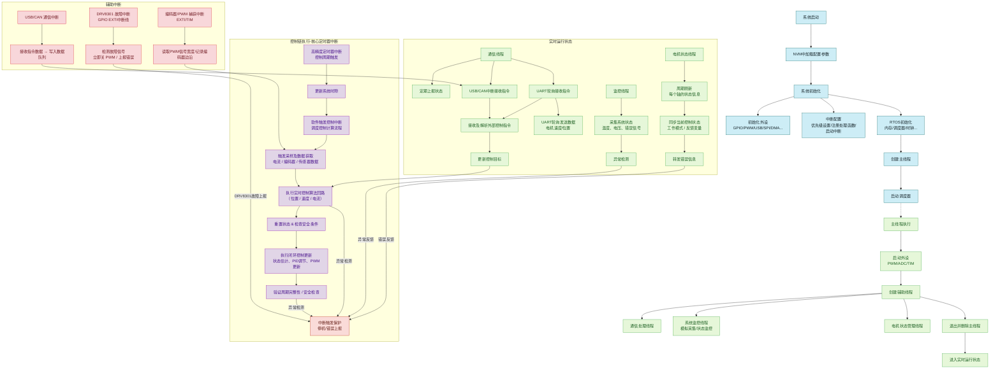

```mermaid
graph TD
    A[系统启动] --> B[NVM中加载配置参数]
    B --> C[系统初始化]
    C --> C1[初始化外设<br>GPIO/PWM/USB/SPI/DMA...]
    C --> C2[中断配置<br>优先级设置/注册处理函数/启动中断]
    C --> C3[RTOS初始化<br>内存/调度器/时钟...]

    C3 --> D[创建主线程]
    D --> E[启动调度器]
    E -.-> F[主线程执行]
    F --> F1[启动外设<br>PWM/ADC/TIM]
    F1 --> F2[创建辅助线程]
    F2 --> F2a[通信处理线程]
    F2 --> F2b[系统监控线程<br>模拟采集/状态监控]
    F2 --> F2c[电机状态管理线程]
    F2 --> G[退出并删除主线程]

    G --> H[进入实时运行状态]

    %% 实时线程部分
    subgraph 实时运行状态
        H1[通信线程]
        H1 --> H1a[定期上报状态]
        H1 --> H1b[USB/CAN中断接收指令]
        H1 --> H1c[UART轮询接收指令]
        H1b --> H1d[接收及解析外部控制指令]
        H1c --> H1d
        H1d --> H1e[更新控制目标]
        H1c --> H1f[UART轮询发送数据<br>电机速度/位置]

        H2[监控线程]
        H2 --> H2a[采集系统状态<br>温度、电压、错误信号]
        H2a --> H2b[异常检测]

        H3[电机状态线程]
        H3 --> H3a[周期刷新<br>每个轴的状态信息]
        H3a --> H3b[同步当前控制状态<br>工作模式 / 反馈变量]
        H3b --> H3c[转发错误信息]
    end

    %% 控制链（由硬件定时器及中断驱动）
    subgraph 控制链执行-核心定时器中断
        T1[高精度定时器中断<br>控制周期触发] --> T2[更新系统时隙]
        T2 --> T3[软件触发控制中断<br>调度控制计算流程]
        T3 --> T4[触发采样及数据获取<br>电流 / 编码器 / 传感器数据]
        T4 --> T5[执行实时控制算法回路<br>（位置 / 速度 / 电流）]
        T5 --> T6[重置状态 & 检查安全条件]
        T6 --> T7[执行闭环控制更新<br>状态估计、PID调节、PWM更新]
        T7 --> T8[验证周期完整性 / 安全检查]
        T5 -->|异常检测| D1[中断触发保护<br>停机/错误上报]
        T8 -->|异常检测| D1
    end

    %% 辅助中断
    subgraph 辅助中断
        U1[USB/CAN 通信中断] --> U2[接收指令数据 → 写入数据队列] --> H1b
        G1[DRV8301 故障中断<br>GPIO EXTI中断线] --> G2[检测故障信号<br>立即关 PWM / 上报错误]
        E1[编码器/PWM 捕获中断<br>EXTI/TIM] --> E2[读取PWM信号宽度/记录编码器边沿] --> T4
    end

    %% 交互链接
    H1e --> T5
    H2b -->|异常反馈| D1
    H3c -->|错误反馈| D1
    G2 -->|DRV8301故障上报| D1

    %% 样式定义
    classDef init fill:#CDEDF6,stroke:#2B7A78,color:#17252A;
    classDef thread fill:#E6F7D9,stroke:#4CAF50,color:#1B5E20;
    classDef runtime fill:#FFF3CD,stroke:#FFC107,color:#7F4E00;
    classDef control fill:#E1D5E7,stroke:#9C27B0,color:#4A148C;
    classDef interrupt fill:#F8D7DA,stroke:#DC3545,color:#721C24;
    classDef error fill:#FADBD8,stroke:#C0392B,color:#641E16;

    %% 分类标注
    class A,B,C,C1,C2,C3,D,E init
    class F,F1,F2,F2a,F2b,F2c,G,H,H1,H2,H3,H1a,H1b,H1c,H1d,H1e,H1f,H2a,H2b,H3a,H3b,H3c thread
    class T1,T2,T3,T4,T5,T6,T7,T8 control
    class U1,U2,G1,G2,E1,E2 interrupt
    class D1 error
```
